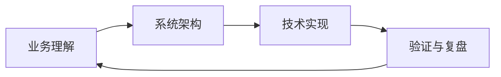

 

::: tip

我是一名关注企业级业务系统的 Java 后端开发者，正在把业务理解、架构设计、技术实现和 AI 工程实践沉淀为长期技术资产。

:::

```mermaid
flowchart LR
  A[业务理解] --> B[系统架构]
  B --> C[技术实现]
  C --> D[验证与复盘]
  D --> A
```

博客不是 API 教程合集，而是我如何理解问题、做出决策并验证方案的公开记录。
