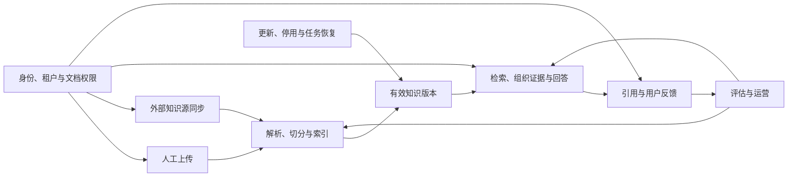

# AI 知识库

本专栏按“AI 知识库 → 业务场景 → 流程模块”整理企业知识库业务，覆盖资料进入、持续同步、检索问答、权限控制、知识维护与质量运营。适合用来理解完整链路、评审需求、拆分开发任务和设计验收场景。

**文档性质：业务设计基线。** 文中的流程、状态和规则描述拟建设系统应具备的行为，不表示本博客已经包含相应后端实现。具体接口、数据库字段、供应商能力和数值门槛需要在项目实施时验证；各篇“实施决策”列出必须明确的项目选择。业务示例均用于解释规则，不代表实际生产数据。

## 业务定位与建设范围

企业资料分散在制度文件、产品手册、文档平台和业务系统中，员工往往需要知道资料在哪里、是否过期、自己能否查看，以及多个规定如何共同适用。AI 知识库将这些资料组织为可检索、可追溯的知识，并围绕具体问题提供有依据的说明。

检索增强生成（RAG）的基本做法是先检索相关资料，再用资料支撑模型回答。概念参考 [Microsoft RAG 概览](https://learn.microsoft.com/en-us/azure/search/retrieval-augmented-generation-overview)；本专栏进一步给出工具无关的业务流程和一致性规则。

| 范围 | 本专栏承担的职责 | 对接边界 |
| --- | --- | --- |
| 文档知识 | 文档身份、版本、解析、片段、索引与引用 | 文件存储与解析组件 |
| 企业资料同步 | 授权接入、变化识别、任务与结果核对 | 来源系统协议 |
| 知识问答 | 在授权范围内检索、组织证据和回答 | 检索、排序与生成服务 |
| 权限与运营 | 租户、资源授权、审计、评估和恢复 | 身份、组织与监控体系 |
| 实时业务数据 | 说明资料时效，识别需要实时查询的问题 | 订单、库存等业务 API 另行授权 |
| 业务动作 | 提供制度与操作指引 | 退款、审批、改单等动作由业务流程执行 |

知识库中的答案不是业务单据，也不会自动完成用户提出的操作。模型训练、复杂智能体和自动执行业务动作可以后续扩展，但需要另行定义授权、确认、幂等和审计。

## 目录结构

```text
AI 知识库
├── 总览与阅读路线
├── 场景1：文档上传入库
│   ├── 上传与校验
│   ├── 文档解析与标准化
│   ├── 内容清洗与切分
│   └── 向量化与索引构建
├── 场景2：外部知识源同步
│   ├── 知识源配置与授权
│   ├── 变更扫描与版本识别
│   ├── 同步任务与内容更新
│   └── 同步结果与状态对账
├── 场景3：知识检索问答
│   ├── 问题理解与检索范围
│   ├── 多路召回与过滤
│   ├── 重排序与上下文组织
│   └── 答案生成与来源引用
├── 场景4：多租户与权限隔离
│   ├── 租户识别与用户身份
│   ├── 知识库授权与路由
│   ├── 文档权限与检索隔离
│   └── 访问审计与权限变更
├── 场景5：知识更新与下线
│   ├── 内容更新与版本切换
│   ├── 标题、标签与元数据更新
│   ├── 文档停用、删除与索引清理
│   └── 失败重试与任务恢复
└── 场景6：质量评估与运营
    ├── 评估样本与基准集
    ├── 检索效果评估
    ├── 回答质量与引用评估
    └── 运行监控与成本优化
```

## 六个场景的业务关系



上传入库和外部同步是两类入口，问答是使用入口，权限贯穿所有入口，维护管理生命周期，评估推动持续改进。六个场景不要求顺序执行。

| 场景 | 典型触发 | 完成标准 |
| --- | --- | --- |
| [文档上传入库](./document-ingestion/README.md) | 人工提交资料 | 文件可追溯、内容完整、有效版本可检索 |
| [外部知识源同步](./source-sync/README.md) | 扫描或变更通知 | 变化已处理、权限正确、结果可对账 |
| [知识检索问答](./qa/README.md) | 用户提问 | 行为符合证据条件，答案与引用可核对 |
| [多租户与权限隔离](./access-control/README.md) | 用户或服务访问资源 | 每一步符合当前身份、范围与动作授权 |
| [知识更新与下线](./knowledge-maintenance/README.md) | 内容、元数据、状态变化 | 正确版本生效，失效知识停止使用，失败可恢复 |
| [质量评估与运营](./quality-operations/README.md) | 策略变更或线上反馈 | 可复现评价、明确问题归因与改进结果 |

## 核心术语与业务对象

| 对象或术语 | 业务含义 |
| --- | --- |
| 租户 | 数据、配置与资源归属边界 |
| 知识库 | 管理一组知识及其访问、检索和发布政策 |
| 知识源配置 | 来源实例、授权范围、同步规则与目标映射 |
| 文档 | 稳定的业务资料身份，标题变化不改变身份 |
| 原始文件 | 接收到的真实文件及原始文件名、摘要和存储引用 |
| 内容版本 | 一次确定的正文快照 |
| 元数据修订 | 标题、标签、分类和适用信息的变化记录 |
| 权限修订 | 主体可访问范围的变化记录 |
| 处理版本 | 特定解析、切分、嵌入等规则生成的一组产物 |
| 知识片段 | 可独立检索且能关联原文的内容单元 |
| 嵌入或向量化 | 将内容转换为供语义检索使用的表示 |
| 召回 | 找出可能与问题相关的候选资料 |
| 重排序 | 对候选与问题的相关性重新排序 |
| 证据上下文 | 经过授权、版本与相关性检查后交给模型的资料 |
| 引用 | 回答中的依据与文档版本、原文位置之间的映射 |
| 任务与尝试 | 任务描述一个业务意图，尝试记录一次具体执行 |
| 扫描批次与游标 | 来源遍历的一轮记录及可恢复进度 |
| 来源目标映射 | 源文档身份与目标文档、版本之间的关系 |

### 数据归属与关系

一个租户拥有多个知识库；一个知识库管理多个文档；一个文档拥有多个内容版本，但普通问答默认使用当前有效版本。一个内容版本可以因处理策略变化拥有多个处理版本，每个处理版本生成一组片段和索引。

会话包含多次问答，请求的证据可以来自多份获准文档。答案引用绑定当次使用的具体版本，后续文档更新不会修改历史事实。

同一物理文件可被多个业务文档引用，但存储去重不合并业务身份或权限。来源文档分发到多个目标知识库时，各目标映射单独维护。

## 统一状态口径

把不同事实分开记录，才能解释“更新失败但旧版仍可用”“目标已成功但回写未确认”等情况。

| 维度 | 建议状态 | 使用原则 |
| --- | --- | --- |
| 文档生命周期 | 有效、停用、删除中、已删除 | 控制是否允许继续使用 |
| 版本与发布 | 构建中、待审核、可发布、已发布、历史、失败 | 描述该版本是否准备好及是否生效 |
| 任务执行 | 待执行、执行中、等待重试、待人工、成功、失败、取消 | 描述业务意图的执行情况 |
| 任务阶段 | 下载、解析、切分、索引、发布、回写、清理等 | 不与执行状态混为一个字段 |
| 扫描批次 | 待执行、进行中、完整、失败、取消 | 完整仅证明枚举与登记范围已确认 |
| 结果回写 | 无需回写、待回写、回写成功、重试中、待人工 | 与目标文档成功分开 |
| 清理进度 | 不需要、待清理、清理中、已完成、存在失败项 | 不阻塞已提交的访问禁用 |

这些是业务概念，不要求照搬为具体枚举或字段。页面“可用”应由以下条件共同得出：

```text
文档未停用或删除
且存在已发布且索引可用的有效版本
且资料满足当前业务适用条件
且当前用户拥有知识库与文档访问权限
```

任务“成功”必须根据该操作定义判断。入库成功要求有效发布，清理成功要求对应资源已核对，回写成功要求来源确认，不能共用一个模糊的判断。

## 跨场景业务规则

1. **身份先于数据访问。** 租户从可信上下文取得，知识库选择经过服务端授权，文档片段、引用、缓存和历史记录继承访问边界。
2. **受理与完成分开。** 异步接口受理后返回可查询的任务，不能把排队等同知识已经可用。
3. **文档身份与展示分开。** 业务标题用于阅读和检索，原始文件名用于来源、下载与解析；同名不等于同文档。
4. **版本快照可追溯。** 任务处理明确输入，内容、元数据和权限分别有修订，迟到结果不能覆盖新事实。
5. **发布有条件。** 完整性、质量、权限、文档状态和目标版本同时符合要求，才允许切换有效版本。
6. **先停止使用，再清理资源。** 停用、删除和撤权不等待所有副本完成删除，受影响访问先受到限制。
7. **重复执行不重复业务意图。** 幂等标识与参数一致性需要校验；外部结果未知时先核对。
8. **来源缺失不等于删除。** 不完整扫描、失去授权或过滤变化需要分别判断。
9. **回答依赖证据。** 关键条件、版本和引用对应；无法确认时澄清、部分回答或说明缺口。
10. **结果与指标有明确口径。** 执行失败、业务无答案、权限拒绝、用户取消和流式中断分别统计。

## 业务动作与结果约定

以下用于需求和接口评审，不是已实现的 API 地址或协议。

| 动作 | 需要校验 | 受理或完成时返回 |
| --- | --- | --- |
| 新增文档 | 写入权限、文件、容量、请求幂等 | 文档、内容版本、任务与受理状态 |
| 更新正文 | 维护权限、期望修订、当前生命周期 | 新版本、更新任务、原有效版本 |
| 修改元数据 | 字段权限、取值与影响类别 | 新修订、必要副本同步状态 |
| 停用或删除 | 操作权限、期望修订、影响范围 | 访问状态、清理任务与未完成项 |
| 扫描来源 | 配置启用、授权、并发策略 | 批次、检查点、统计与完成状态 |
| 查询任务 | 租户与资源可见范围 | 阶段、结果、错误类别与可操作入口 |
| 发起问答 | 身份、范围、问题、会话归属 | 完成状态、答案、引用或明确非回答结果 |
| 修改权限 | 授权管理资格、影响范围 | 权限修订、审计事件与传播状态 |
| 人工恢复 | 恢复权限、真实结果、输入是否变化 | 恢复操作记录与关联任务 |

错误至少区分校验、授权、冲突、依赖失败、结果未知和不可恢复。用户看到可理解的原因，运营凭追踪编号查看受控诊断。错误响应不包含密钥、签名 URL、受限正文或内部堆栈。

## 系统能力边界与交接责任

| 能力 | 负责内容 | 必须交出的证据 |
| --- | --- | --- |
| 文档管理 | 资料身份、版本、标题和生命周期 | 当前有效版本及变更记录 |
| 内容处理 | 解析、切分和索引 | 输入版本、产物、质量与数量核对 |
| 同步编排 | 扫描、任务、映射和回写 | 检查点、来源版本、结果确认 |
| 检索问答 | 问题、证据、生成和引用 | 范围、实际证据、回答状态 |
| 身份权限 | 主体、资源、动作和修订 | 当前授权判断与审计 |
| 运营恢复 | 监控、对账、补偿和评估 | 差异、操作原因与恢复结果 |

这些是逻辑职责，可以先在一个应用中实现，不要求为了目录结构拆成多个微服务。采用 Dify、MinerU 或其他组件时，应将组件行为映射到这些职责，而不是把某个组件的“成功”直接当成整条业务链路成功。

## 一次完整的业务推演

售后负责人上传《X200 寄修规范》，正文说明不同保修状态下的维修费用和运费。系统保存原文件，发现收费表识别不完整，转人工复核。修正后索引完整并经过审核，发布 v1。

客服在售后知识库询问“过保寄修怎么收费”，系统按其权限检索当前版本，保留型号和过保条件，组织收费与运费证据后回答，引用定位到原文条款。

来源平台后来发布 v2。同步扫描登记新任务，v2 构建时 v1 在仍有效的前提下继续服务；v2 发布后，新请求使用 v2，历史回答仍保留 v1 的依据。若 v1 已失效，则先停用，不为维持响应继续使用错误政策。

主管专属赔付表对客服不可见。主管调岗后，权限变化同时影响检索、缓存、历史复用和引用访问。若 v2 结果回写失败，只补回写；若文档被删除，旧任务即使返回成功也不能恢复它。

运营把一次遗漏运费条件的错误回答加入基准集，修复上下文选择后重跑检索和回答评估，再受控发布。

## 建设顺序与退出条件

| 阶段 | 建设内容 | 进入下一阶段的条件 |
| --- | --- | --- |
| 最小可用闭环 | 人工上传、解析索引、明确范围问答与引用 | 一个真实业务资料集能走通，权限和失败可解释 |
| 持续更新 | 来源同步、版本维护、停用与结果对账 | 漏扫、重复、乱序和下线有可恢复处理 |
| 权限完善 | 文档授权、撤权、缓存与历史约束 | 跨租户、跨角色及撤权回归通过 |
| 稳定运行 | 租约、重试、人工恢复、监控与费用归集 | 崩溃和外部结果未知能恢复 |
| 持续优化 | 基准集、检索评估、回答评估与发布回退 | 改进可复现，关键业务类别不退化 |

身份、租户隔离与必要文档授权必须从最小闭环开始；“权限完善”阶段是增强细粒度能力，不是允许前期跳过访问控制。

## 统一验收清单

| 类别 | 必验场景 |
| --- | --- |
| 内容质量 | 扫描件、表格、否定条件、不同型号与来源定位 |
| 幂等与并发 | 重复上传、重复事件、并发更新、旧任务迟到 |
| 生命周期 | 首次入库、更新失败、停用、删除、回滚、来源重扫 |
| 权限 | 跨租户、角色差异、撤权、缓存、会话、原文与引用 |
| 异常恢复 | 超时、限流、硬退出、租约接管、定时漏跑、回写失败 |
| 问答行为 | 有答案、无答案、部分答案、缺条件、冲突与系统失败 |
| 运营评估 | 样本可复现、指标分母一致、成本包含重试、回退可执行 |

这些是验收设计，不代表已经执行通过。实施时为每个案例补入实际输入、预期、执行记录和证据，才能形成系统验收结论。

## 需要项目确认的决策

| 决策 | 本专栏基线 | 确认责任 |
| --- | --- | --- |
| 来源与目标范围 | 显式配置并校验授权 | 业务负责人、管理员 |
| 发布方式 | 完整版本发布，按知识库决定人工审核 | 知识负责人 |
| 更新期间旧版使用 | 旧版仍有效才可继续使用 | 业务负责人 |
| 来源权限映射 | 不扩大来源授权范围 | 身份与数据负责人 |
| 删除与留存 | 先阻断，资源按策略清理 | 数据与运营负责人 |
| 服务与成本目标 | 依据真实流量、样本和预算制定 | 项目与运营负责人 |
| 外部能力限制 | 实测格式支持、幂等、查询和索引可见性 | 集成与开发负责人 |

## 阅读与维护方式

第一次阅读从[上传入库](./document-ingestion/README.md)和[知识问答](./qa/README.md)建立正向链路，再读同步、权限、维护和运营。评审时先统一本页的对象与状态，再逐篇核对“实施决策”和验收案例。

每篇模块文档描述目标、输入输出、处理流程、业务规则、异常恢复、业务示例和验收。后续接入真实项目时，在相应模块追加实际接口、数据模型和验证证据，并注明与本基线的差异。

配套实践入口：[AI 知识库项目](../../projects/ai-knowledge-base/README.md)。

## 参考资料

以下资料用于核对通用概念与风险边界，具体状态、职责和验收方案属于本专栏的设计整理，不代表引用来源推荐了全部方案。查阅日期：2026-10-04。

- [Microsoft：RAG 概览](https://learn.microsoft.com/en-us/azure/search/retrieval-augmented-generation-overview)：检索证据与生成回答的基本关系。
- [Microsoft：文档级访问控制](https://learn.microsoft.com/en-us/azure/search/search-document-level-access-overview)：查询阶段的文档权限约束。
- [OWASP：提示注入防护](https://cheatsheetseries.owasp.org/cheatsheets/LLM_Prompt_Injection_Prevention_Cheat_Sheet.html)：检索资料中的恶意指令与系统边界。
- [AWS Builders' Library：幂等 API 与安全重试](https://aws.amazon.com/builders-library/making-retries-safe-with-idempotent-APIs/)：请求意图、重试与结果确认。

