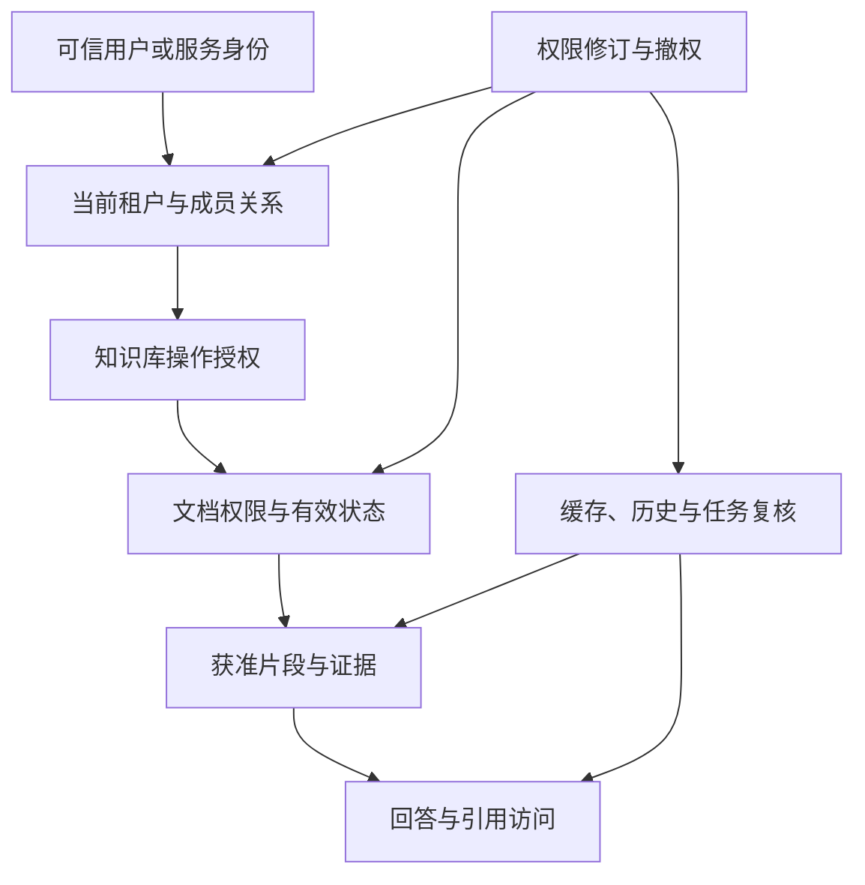

# 多租户与权限隔离

权限贯穿上传、同步、检索、回答、引用、下载与运营。它的业务目标是每个主体只对获准资源执行获准动作，并让授权变化能够影响后续访问。

## 业务对象与层次

各层共同限制最终范围。知识库允许阅读但文档明确受限时，不能仅凭上层授权放行；系统服务身份拥有技术连接能力，也不意味着它可以替用户读取全部数据。

## 角色与权限矩阵

下表是职责分离基线，具体授权仍以租户和资源范围为准。

| 角色 | 典型职责 | 需要单独授权的能力 |
| --- | --- | --- |
| 普通使用者 | 问答、查看获准引用 | 上传、修改、删除 |
| 知识维护员 | 新增与维护分配的资料 | 授权管理、发布审核 |
| 业务审核员 | 审核内容与适用条件 | 来源连接、租户成员管理 |
| 知识库管理员 | 管理本库配置与成员 | 读取受特殊限制的正文 |
| 租户管理员 | 成员、租户配置、管理职责分配 | 跨租户数据访问 |
| 同步服务身份 | 指定来源与目标的自动任务 | 非任务范围的任意读取 |
| 审计与运维 | 查规定范围的状态与记录 | 无条件查看所有正文 |

角色可按组织规模合并，但合并不应使审计失去操作主体和动作区别。

## 业务流程

1. 接入可信身份，确认当前租户及成员资格。
2. 验证知识库归属、可用状态和请求动作。
3. 将文档权限与业务筛选合入允许范围。
4. 在数据访问、检索和派生产物使用过程中保持范围约束。
5. 输出、引用跳转和下载时执行必要的当前状态复核。
6. 记录审计；权限变化后阻断旧授权并推动副本更新。

后台同步还要验证来源服务身份。来源允许机器读取，不一定意味着所有目标用户都有权阅读，必须明确来源与目标用户范围如何映射。

## 流程模块

| 模块 | 关注点 |
| --- | --- |
| [租户识别与用户身份](./tenant-identity.md) | 谁在操作、代表哪个租户 |
| [知识库授权与路由](./dataset-authorization.md) | 可以操作哪个库、通过哪个受控目标执行 |
| [文档权限与检索隔离](./document-permissions.md) | 哪些文档和派生产物可以使用 |
| [访问审计与权限变更](./audit-revocation.md) | 授权变化如何生效并留痕 |

## 权限变化的完成标准

权限规则提交成功之后，首先确保当前访问判断使用新规则，再刷新索引、缓存、会话派生产物和任务状态。各副本有独立确认，不能以一个“权限同步成功”隐藏仍未更新的部分。

收紧权限时应立即拒绝无法确认的访问。扩展权限可以等待内容与权限副本准备好后开放。授权未知、权限接口异常或文档缺少必要字段时，不采用公开默认值。

## 场景推演

用户在租户 A 是售后主管，在租户 B 是普通员工。切换租户后，知识库列表、会话、缓存和服务路由均按 B 重新确定。即使提交 A 的文档编号，也不能跨租户读取。

随后用户在 A 被撤销主管权限，内部赔付规则立即从其有效访问范围中移除；缓存和索引继续刷新，但当前回答不能再依赖旧权限。已下载到用户设备的历史文件不在系统可自动收回范围内。

## 页面与运营动作

授权页面展示主体、资源、动作、有效期、继承来源和最近变更。撤权操作展示受影响文档、用户、服务身份与在途任务。审计界面提供变更前后范围、原因和关联请求，日志自身也有访问权限。

## 场景验收

验证横向跨租户、纵向越权、会话盗用、引用转发、缓存串用、权限标签遗漏和撤权传播。检查原文、片段、候选、上下文、答案和日志多个层面，而不只是前端菜单是否隐藏。

项目实施前需要确定身份来源、组织同步机制、资源角色矩阵、权限继承、撤权时延、敏感内容的流式策略及审计留存政策。

[返回 AI 知识库总览](../README.md) · [关联场景：知识检索问答](../qa/README.md)

