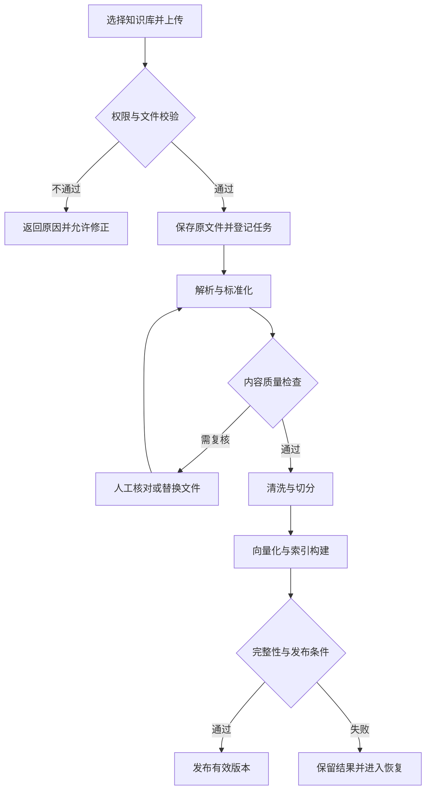

# 文档上传入库

文档上传入库把企业已有资料转成可检索知识，覆盖从受理文件到发布有效版本的全过程。适用于人工维护制度、产品手册、操作规范和常见问题等场景。

## 业务目标与完成标准

用户需要知道文件是否被接收、处理到了哪一步、何时可以提问，以及失败应怎样处理。成功标准是文档有明确归属和权限、内容质量合格、索引完整、有效版本可检索、引用能定位原文。

上传进度达到 100%、解析接口返回成功或索引服务接受写入，都不能单独作为整个场景完成的证明。

## 参与角色

| 角色 | 责任 |
| --- | --- |
| 知识维护人员 | 选择知识库、提交文件与标题、处理内容问题 |
| 知识库管理员 | 管理类型、容量、访问范围和发布政策 |
| 业务审核人员 | 核对关键条款、表格和适用条件 |
| 系统执行器 | 解析、切分、索引、状态更新和失败恢复 |
| 使用者 | 在授权范围提问、查看引用并反馈问题 |

## 主流程与分支

需要人工发布审核时，在索引准备完成后等待审核；自动发布场景由质量、完整性和状态检查决定能否发布。外部同步下载的文件可以复用同一处理链路。

## 模块与交接数据

| 模块 | 输入 | 交付结果 |
| --- | --- | --- |
| [上传与校验](./upload-validation.md) | 文件、标题、知识库、可信身份 | 文件记录、文档版本、处理任务 |
| [文档解析与标准化](./parsing.md) | 原文件版本 | 标准内容、来源位置、质量报告 |
| [内容清洗与切分](./chunking.md) | 标准内容与规则 | 可理解且可追溯的片段集合 |
| [向量化与索引构建](./indexing.md) | 片段与检索配置 | 索引构建结果及有效发布版本 |

每一步固定输入版本并记录产物。任务重试可以复用匹配版本的已完成结果，不能将不同内容版本的半成品拼接发布。

## 核心对象与状态展示

文档保存稳定身份、业务标题和归属；文件记录保存原始文件名与存储引用；内容版本固定正文快照；处理任务保存阶段与执行状态；索引构建记录说明哪些片段写入成功。

页面建议展示“已接收、处理中、待审核、可用、处理失败”等业务标签，但后台分别维护文档生命周期、版本发布状态和任务执行状态。已有旧版本时，新版处理失败不等于整份文档不可用。

## 业务规则

- 用户必须拥有目标知识库写入权限，发布时再核对当前授权和文档状态。
- 业务标题与原始文件名分开，文件名相同不代表同一文档。
- 重复请求通过请求标识归并；相同内容另建文档属于独立业务决策。
- 默认完整发布一个文档版本；缺失关键页、表格或片段时阻止发布。
- 解析器、切分规则和嵌入模型调整形成可追踪处理版本。
- 不可用内容不进入问答；失败记录保留操作入口和明确责任阶段。

## 场景推演

售后主管上传 12 页《寄修操作规范》。系统受理后发现第 8 页收费表解析缺失，显示待复核。主管替换为清晰版本，系统完成切分与索引。审核人员确认免费维修条件和运费条款后发布，客服可以提问并点击引用定位到对应页。

如果主管重复点击上传，系统返回原任务；如果首次发布前被撤销权限，任务不能继续自动发布。

## 页面与业务动作

| 页面或动作 | 应反馈的信息 |
| --- | --- |
| 上传 | 支持类型、限制、目标知识库与逐文件结果 |
| 文档列表 | 当前是否可用、最新更新任务和责任人 |
| 任务详情 | 阶段、尝试记录、质量问题与恢复入口 |
| 内容预览 | 原文与提取结果、表格和来源位置 |
| 发布审核 | 差异、质量报告、前后版本与审核意见 |
| 重试 | 重试的具体阶段、输入版本和影响范围 |

## 场景验收与边界

用正常文本、扫描件、表格、损坏文件、重复请求、服务超时和处理期间撤权组成验收组合。检查原文、片段、索引、有效版本和引用是否一致，而不仅核对任务状态。

本场景负责知识准备。实时业务数据查询、工具执行和模型训练分别规划；解析工具能读取某种格式不等于已验证该格式在实际业务样本中的质量。

[返回 AI 知识库总览](../README.md) · [后续场景：知识检索问答](../qa/README.md)

