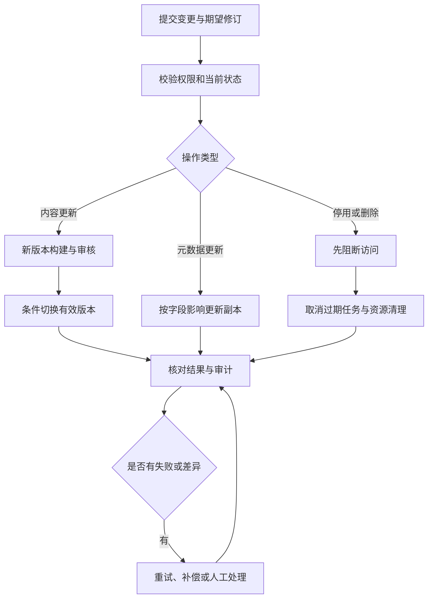

# 知识更新与下线

知识维护管理文档从变更到退出使用的生命周期。内容可能更新、标题与标签可能调整、制度可能失效、来源权限可能撤销，系统需要按不同意图处理并保持可追溯。

## 业务目标与角色

维护人员提交变化，业务审核人员确认规则，管理员管理下线与恢复权限，执行器完成索引和清理，运营人员处理失败和差异。场景目标是有效知识持续可用、失效知识及时停止使用、恢复操作不破坏当前正确状态。

## 变更分类与主流程

权限收紧、适用期失效等变化需要先作用于访问判断，不等待完整内容重建。

## 模块职责

| 模块 | 核心结果 |
| --- | --- |
| [内容更新与版本切换](./content-versioning.md) | 新正文可靠发布，旧版本可追溯 |
| [标题、标签与元数据更新](./metadata-updates.md) | 展示、检索与业务适用信息一致 |
| [文档停用、删除与索引清理](./disable-delete.md) | 失效知识不再使用，清理可确认 |
| [失败重试与任务恢复](./failure-recovery.md) | 未完成意图可恢复，重复执行不破坏结果 |

## 生命周期与状态口径

| 状态维度 | 说明 |
| --- | --- |
| 文档生命周期 | 有效、停用、删除中、已删除 |
| 内容与处理版本 | 构建中、待审核、可发布、已发布、历史、失败 |
| 任务执行 | 待执行、执行中、等待重试、待人工、成功、失败、取消 |
| 资源清理 | 不需要、待清理、清理中、已完成、存在失败项 |
| 来源结果回写 | 另行记录，不推翻已确认的目标结果 |

是否可用于问答由文档生命周期、有效版本、业务适用条件和当前权限共同决定。“任务失败”不必然表示文档不可用；“删除已受理”不表示所有备份与外部副本已消失。

## 并发场景与业务规则

| 同时发生的操作 | 规则 |
| --- | --- |
| 新内容构建与标题修改 | 分维度更新，旧任务不能覆盖新标题 |
| 新内容构建与撤权 | 发布使用当前权限 |
| 更新与删除 | 删除阻断发布，旧任务产物后续清理 |
| 两个版本乱序完成 | 只允许获准目标生效 |
| 删除与来源重扫 | 按排除或恢复政策处理，防止自动复活 |
| 回滚与权限变化 | 回滚内容不回滚权限 |

操作需要稳定业务标识与期望修订。外部结果未知时先核对，不能以重复点击“重试”替代结果判断。

## 场景推演

《寄修规范》v1 正在使用，维护员上传 v2，随后管理员发现 v1 有错误并立即停用。v2 构建完成后，不能因为任务成功就忽略停用状态直接发布。需要按重新启用或发布授权完成状态检查。

如果仅是常规更新且旧规则仍有效，v2 构建失败时 v1 可以继续使用。两种情况取决于业务失效规则，不能一概采用“失败就继续旧版”。

## 操作页面

文档详情显示当前有效版本、最新待处理版本、标题和权限修订、来源关系及历史发布。操作入口明确区分更新正文、修改元数据、停用、删除、恢复和回滚。

任务详情显示当前阶段、执行者、尝试、租约、检查点和外部结果。人工补偿需要选择意图并填写原因；不提供无依据的“强制成功”来掩盖缺失产物。

## 验收组合

从一个已发布文档出发，连续验证新版本失败、并发元数据更新、权限撤销、删除期间旧任务返回、清理部分失败和受控恢复。每一步核对问答、引用、原文件、索引、任务和审计。

项目需要明确版本保留、业务生效期、审批规则、删除范围、来源排除和恢复时限。全链路恢复还应验证进程硬退出和定时槽位已领取但任务未建立的情况。

[返回 AI 知识库总览](../README.md) · [关联场景：外部知识源同步](../source-sync/README.md)

