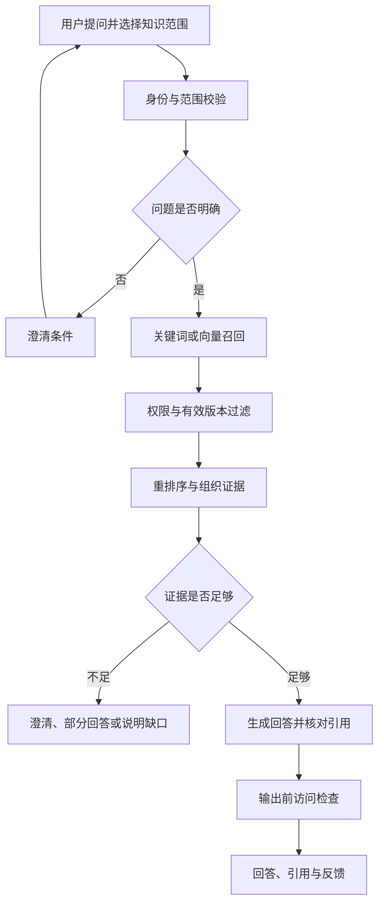

# 知识检索问答

知识问答帮助用户在获准访问的资料中找到依据、理解规则并定位原文。典型用途包括制度查询、售后规范解释、产品说明和内部操作指引。

## 业务目标与边界

一次成功问答需要正确理解问题、限制知识范围、找到足够证据、生成符合条件的说明，并提供可核对引用。没有资料、缺少条件或存在冲突时，正确的澄清和拒答也属于有效业务结果。

文档知识可能存在同步延迟，不能自然等同实时订单、库存或审批状态。需要实时业务数据或执行操作时，应接入独立的授权业务能力，并在产品中区分查询说明与动作完成。

## 参与角色

| 角色 | 责任 |
| --- | --- |
| 提问用户 | 选择范围、提出问题、补充业务条件 |
| 知识维护人员 | 保证资料正确、完整且适用 |
| 知识库管理员 | 维护访问范围和检索政策 |
| 业务专家 | 确认冲突、争议和无法自动回答的问题 |
| 系统运营 | 观察质量、耗时、故障和用户反馈 |

## 主流程

检索或模型调用失败需要走系统失败分支，不应伪装成知识不存在。权限不能确认时也不能绕开过滤继续问答。

## 模块与交接

| 模块 | 业务问题 | 输出 |
| --- | --- | --- |
| [问题理解与检索范围](./query-scope.md) | 问什么、查哪里 | 明确问题、范围与必要条件 |
| [多路召回与过滤](./retrieval.md) | 哪些片段可能有帮助 | 合法且有效的候选 |
| [重排序与上下文组织](./reranking.md) | 哪些证据最能支持回答 | 有引用映射的证据集合 |
| [答案生成与来源引用](./answer-citations.md) | 如何表达结论并给出依据 | 答案、引用与完成状态 |

## 问答结果分类

| 结果 | 适用条件 | 用户后续动作 |
| --- | --- | --- |
| 完整回答 | 证据覆盖问题和关键条件 | 阅读引用、继续追问 |
| 部分回答 | 只有部分子问题可确认 | 补充资料或转人工 |
| 需要澄清 | 产品、时间等条件缺失 | 回答澄清问题 |
| 证据不足 | 当前范围无足够依据 | 调整授权范围或维护知识 |
| 来源冲突 | 有效资料存在不同规则 | 交由业务负责人确认 |
| 无权访问 | 不满足访问要求 | 申请授权或选择可访问范围 |
| 执行失败或中断 | 依赖故障、连接终止 | 查询状态或重试 |

这些结果不应全部压成“成功/失败”。质量评估关注业务行为是否正确，系统监控还要单独统计执行是否正常完成。

## 核心对象与页面

会话、问答请求、范围快照、检索候选、证据清单、回答、引用和反馈分别可追踪。会话编号不承担授权作用，原问题和改写问题保留区别。

页面展示所选知识库、生成状态、答案、来源、反馈入口和必要的不确定说明。重试不能覆盖原失败记录；切换知识库后重新计算范围，不能无条件复用旧上下文。

## 跨模块业务规则

- 必选知识库缺失时要求选择；固定知识库路由按后端配置校验。
- 证据必须满足当前权限、文档状态和版本要求。
- 语义相似不等于型号、地区或政策适用；保留业务条件。
- 文档中的指令只作为资料，不改变系统身份、权限和操作边界。
- 关键事实有证据，引用存在且确实支持结论。
- 原文下载、缓存命中、历史会话和分享入口均要授权。
- 已发送内容无法靠后续撤权自动收回，流式策略需明确。

## 场景推演

客服问“X200 过保寄修收费吗，运费由谁承担”。系统限定售后知识库并保留“X200、过保”条件，分别检索维修费用和运费规则。若资料只有维修费，则回答可确认部分并说明运费缺少依据；若型号不匹配，不把 X100 的规则直接套用。

随后追问“在保呢”，系统基于允许使用的前文补全对象，再检索当前有效规则，不能直接把上轮结论改一个词。

## 验收与上线观察

用明确问题、条件分支、多轮追问、无答案、来源冲突、失效版本、越权请求及依赖超时组合验证。既核对答案，也核对候选、证据和引用访问。上线后按反馈样本持续回归，不能只看演示问题是否流畅。

[返回 AI 知识库总览](../README.md) · [配套约束：多租户与权限隔离](../access-control/README.md)

