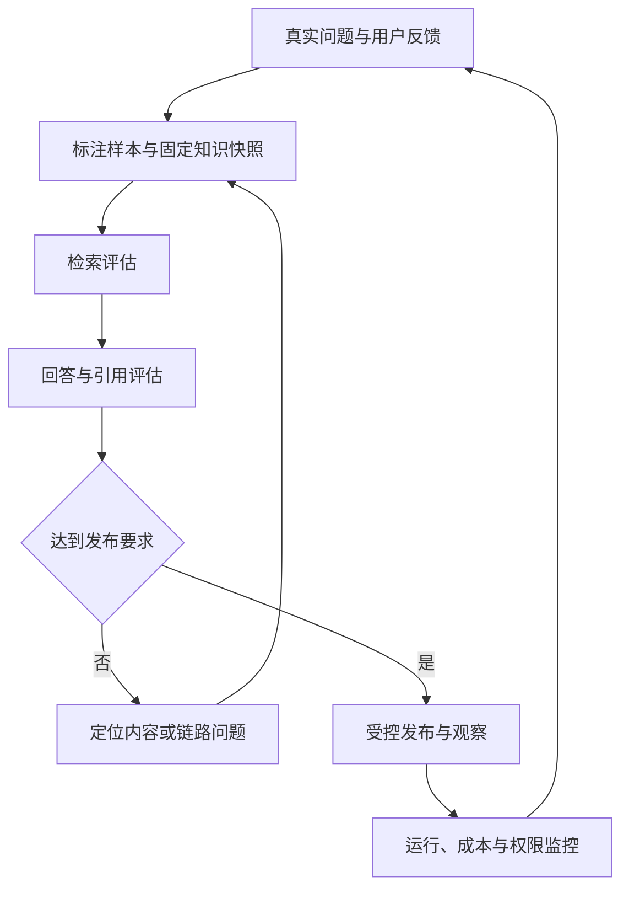

# 质量评估与运营

质量评估回答“系统在指定业务范围内是否可靠”，运营回答“真实运行是否持续符合要求”。两者结合，才能发现内容过期、召回遗漏、回答错误、权限缺陷与成本异常。

## 业务目标与责任

| 角色 | 责任 |
| --- | --- |
| 业务专家 | 确定正确规则、关键条件和严重错误 |
| 知识维护人员 | 修复内容、确认来源与版本 |
| 测试与评估人员 | 建立样本、执行评估、复核结果 |
| 检索与应用开发人员 | 定位链路问题并提供可回退变更 |
| 运营与运维人员 | 监控服务、积压、用户反馈和成本 |
| 发布负责人 | 综合质量、权限、稳定性与成本决定发布 |

成功标准包含业务行为正确、证据可追溯、权限边界满足要求、故障可恢复和费用可解释。任何一个平均分都不能代替全部判断。

## 持续改进流程

调优使用的样本与独立验收样本要有边界。线上故障和用户投诉转为回归样本后，还需要验证相邻条件，避免只修一个句子的表现。

## 流程模块

| 模块 | 主要产物 |
| --- | --- |
| [评估样本与基准集](./evaluation-dataset.md) | 带身份、知识快照和预期行为的样本 |
| [检索效果评估](./retrieval-evaluation.md) | 证据覆盖、相关性、排序与隔离结果 |
| [回答质量与引用评估](./answer-evaluation.md) | 正确性、完整性、依据、引用及拒答结果 |
| [运行监控与成本优化](./monitoring-cost.md) | 运行指标、费用归集、告警和改进闭环 |

## 基准版本与可重复性

一次评估至少固定样本版本、文档快照、权限修订、解析切分版本、嵌入与排序配置、生成模型配置和提示规则。输入或知识变化后，不能把成绩差异全部解释为模型进步或退步。

保存每次执行结果、失败样本、人工修订和发布决策。工具自动评分可以辅助，但关键业务结论和严重失败需要人工可解释的依据。

## 发布判断

| 维度 | 判断方式 |
| --- | --- |
| 业务正确性 | 关键结论、条件和例外满足样本要求 |
| 证据质量 | 参考资料可召回，引用真实且支持结论 |
| 无答案行为 | 对知识缺口、冲突和系统失败作正确区分 |
| 权限与时效 | 不使用越权、停用或错误版本内容 |
| 运行能力 | 超时、重启、重试和回写可恢复 |
| 性能与成本 | 满足项目约定的目标和预算 |
| 回退能力 | 新策略出现问题时可切回可用版本 |

阈值应由项目实际样本、业务风险与流量确定。本文不预设未经运行验证的“准确率达到多少”或“所有请求多少秒内返回”。

## 场景推演

团队调整切分规则后，总体命中率上升，但收费表的单位在部分片段中丢失。检索评估可能显示覆盖改善，回答评估却发现费用解释错误。该变更不能仅凭命中率上线，应修复表格切分并重跑相关业务类别。

另一次缓存优化降低了费用，但用户撤权后仍收到旧答案。即使平均响应更快，也应撤回变更并修复缓存授权。

## 运营工作台

工作台至少提供知识更新状态、任务积压、问答完成与失败、反馈分类、引用问题、权限传播和费用趋势。每个异常应能下钻到文档、版本、请求或任务，不只展示图表总量。

对失败结果的处置分为修内容、调检索、调生成、修权限或恢复系统；每项有负责人、证据、修复版本和复测结果。

## 验收与实施决策

验证样本可复现、指标分母明确、缺失样本可见、严重问题不被平均分掩盖、故障不被静默移除、成本包含失败与重试。上线前明确标注责任、独立验收集、发布门槛、告警与回退负责人。

[返回 AI 知识库总览](../README.md) · [关联场景：知识检索问答](../qa/README.md)

