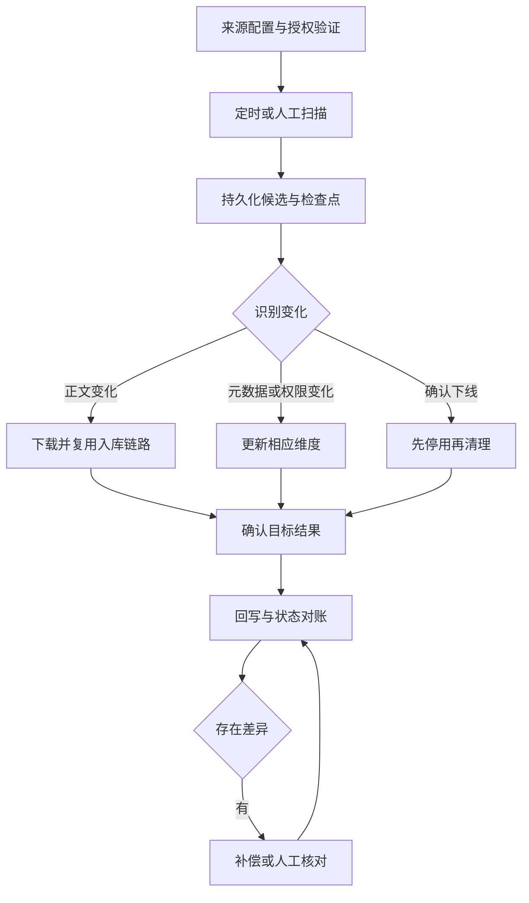

# 外部知识源同步

外部同步将文档平台、业务系统或对象存储中的授权内容持续纳入知识库。它需要处理来源变化、任务执行和结果确认三个环节，使目标知识跟随来源演进。

## 业务目标与参与角色

| 角色 | 责任 |
| --- | --- |
| 来源内容负责人 | 维护正文、生效范围和来源权限 |
| 租户管理员 | 确认接入范围、目标知识库与执行周期 |
| 源系统管理员 | 授予目录读取、下载及必要回写权限 |
| 集成与运维人员 | 处理连接、任务、版本差异和恢复 |
| 知识使用者 | 使用已发布知识并反馈过期内容 |

场景成功不只是“定时器运行过”，而是变化被可靠发现、任务已登记并处理、目标内容与权限正确、必要结果已被来源确认。

## 主流程

事件通知可以减少延迟，周期扫描与对账负责发现遗漏。是否同时使用由来源能力决定，不将某一次通知当作唯一事实来源。

## 模块与交接

| 模块 | 解决的问题 | 输出 |
| --- | --- | --- |
| [知识源配置与授权](./source-config.md) | 从哪里取、允许取什么 | 有效配置和授权范围 |
| [变更扫描与版本识别](./change-detection.md) | 哪些文档发生何种变化 | 不可变候选快照和受理进度 |
| [同步任务与内容更新](./sync-tasks.md) | 如何可靠执行变化 | 目标映射、版本与业务结果 |
| [同步结果与状态对账](./result-reconciliation.md) | 三方状态是否一致 | 回写确认、差异与补偿记录 |

## 核心对象与状态

配置、扫描批次、来源文档、变更候选、执行任务、目标映射和回写结果分别建模。来源身份与目标文档身份不能混用，标题与下载 URL 不承担稳定主键职责。

扫描批次记录是否完整、读取到哪里、候选是否已可靠登记；任务记录执行阶段；目标记录是否可用；回写记录是否确认。来源已变化但目标尚未发布，是需要展示的同步延迟。

## 必须统一的业务规则

- 配置启用、授权有效和目标可写同时满足，才允许正式同步。
- 扫描中断不能触发缺失删除；来源授权缩小也不能直接等同文件被删除。
- 候选快照与任务输入固定，下载内容必须匹配所处理版本。
- 受理游标可以在任务可靠登记后推进，业务完成水位单独记录。
- 正文、元数据和权限使用各自修订，避免无关维度相互覆盖。
- 来源权限收紧优先阻断访问，索引刷新和全文处理异步完成。
- 目标成功与回写成功分开恢复，回写失败不重建全文。
- 迟到任务和迟到回写不能回退新版本状态。

## 场景推演

第一次同步发现 200 份资料，分 5 页列举，第 4 页读取失败。已经登记的新增任务可以继续执行，但不能删除未出现在前三页的旧文档。续扫完成后核对范围，再处理真正缺失项。

其中某文档从 v2 更新到 v3，目标已发布 v3，但来源回写失败。使用者可以访问 v3，运营界面显示“目标成功、回写重试中”，只需补回写。若随后收到旧 v2 事件，应识别为历史变化。

## 调度与恢复责任

周期执行需要明确时区、停机补跑、并发限制和扫描窗口。调度器领取本轮槽位、建立扫描批次、执行文档任务、回写结果是不同阶段，任何阶段退出都需要持久记录支撑恢复。

不要仅凭注解、任务配置或 Bean 存在证明实际同步运行。运行确认需要最近批次、候选、目标版本和完成记录。

## 运营与验收

管理台展示授权有效性、最近完整扫描、候选统计、积压、失败、回写异常和来源目标差异。人工入口区分补扫、重试任务、补回写和状态核对。

验收覆盖分页失败、游标过期、来源权限变化、版本乱序、重复事件、目标响应丢失、调度重启和回写失败。上线前明确来源版本协议、删除证据、权限映射和可接受的更新延迟。

[返回 AI 知识库总览](../README.md) · [复用能力：文档上传入库](../document-ingestion/README.md)

