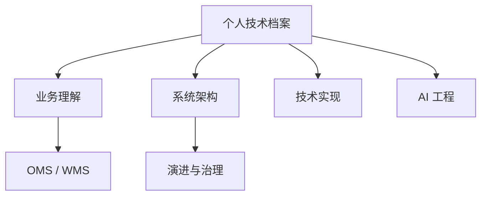

# 架构设计

这一部分记录“为什么这样设计”，而不是堆砌技术名词。每篇内容尽量说明背景、约束、候选方案、取舍和验证结果。

## 能力地图

```mermaid
flowchart TB
  A[个人技术档案]
  A --> B[业务理解]
  A --> C[系统架构]
  A --> D[技术实现]
  A --> E[AI 工程]
  B --> F[OMS / WMS]
  C --> G[演进与治理]
```
