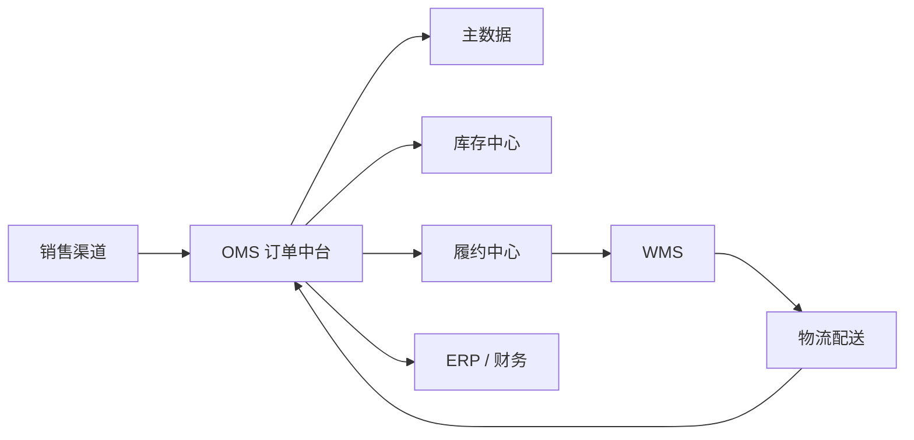

# OMS 总览

OMS 不是简单保存订单，而是连接销售渠道、订单、库存、仓库、物流、财务和供应链的业务中枢。

## OMS 在企业系统中的位置



## OMS 要解决的问题

- 统一接入淘宝、京东、抖音、直营和经销商等多渠道订单。
- 统一管理订单生命周期、库存分配和履约状态。
- 通过“一盘货”视角共享多组织、多仓库存。
- 将仓库执行、物流回传、结算和售后串成业务闭环。

## 核心业务模块

主数据、订单中心、商品中心、客户与渠道、库存中心、履约中心、售后中心、财务结算、系统集成和异常中心共同组成 OMS。

## 订单全链路

```text
订单产生 → 进入 OMS → 订单审核 → 寻仓/分配库存 → 拆单或合单
→ 生成履约任务 → WMS 执行 → 物流配送 → 签收/售后 → 结算完成
```
