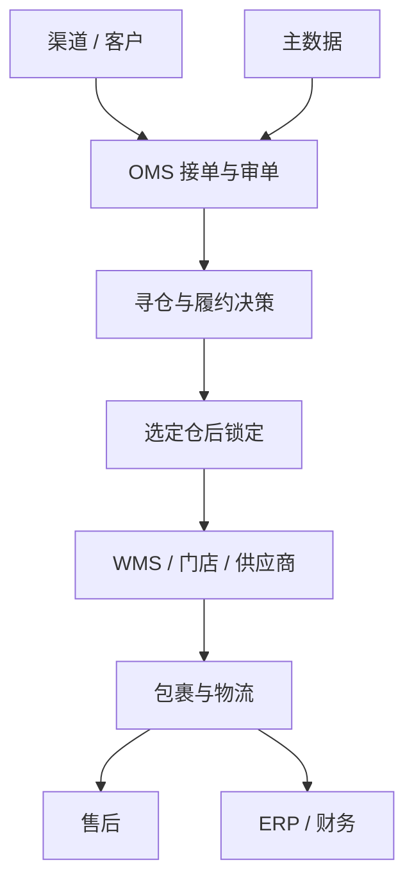

# OMS 总览

> 本专栏围绕未来自建 OMS，整理业务模型、开发设计和验收路径。现有业务页面用于建立完整链路，建设章节给出一期设计基线；方案和示例尚未对应已运行的后端，实际渠道、仓库与财务规则需在实施前确认。

OMS 连接销售渠道、订单、库存、仓库、物流、售后和财务。它首先记录客户买了什么，再协调库存与履约，并接收仓库和物流的执行结果。

先看[OMS 业务覆盖与缺口清单](./business-coverage.md)，可快速核对每类业务已有的说明、一期与扩展边界，以及仍需真实协议确认的规则。

## 为搭建系统如何阅读

1. **定范围**：阅读[OMS 建设范围与实施路线](./construction-plan.md)，明确第一版做什么、后续扩什么及每阶段的退出条件。
2. **走业务**：用[业务场景与单据推演](./business-scenarios.md)串起拆仓、部分发货、取消和退货，再深入下面的业务模块。
3. **做设计**：从[模块架构与事务边界](./technical-architecture.md)进入[数据模型与约束](./data-design.md)和[接口与事件契约](./api-contracts.md)。
4. **补恢复**：核对[一致性与恢复设计](./consistency-recovery.md)，尤其是下发超时、取消竞态、任务崩溃和退款未知结果。
5. **验交付**：结合[运营工作台与权限](./operations.md)和[测试与上线验收](./acceptance.md)，把业务规则落为页面操作和可重复的场景检查。

一期建议从直营零售、现货实物商品、共享库存池开始。业务知识部分仍保留经销、代发、预售、配额和维修等扩展模型；这些内容不代表第一版必须同时实现。实践入口见[Mini OMS](../../../projects/mini-oms/README.md)。

## OMS 在业务链路中的位置


```mermaid
flowchart TB
  C["渠道 / 客户"] --> O["OMS 接单与审单"]
  M["主数据"] --> O
  O --> F["寻仓与履约决策"]
  F --> I["选定仓后锁定"]
  I --> W["WMS / 门店 / 供应商"]
  W --> T["包裹与物流"]
  T --> A["售后"]
  T --> E["ERP / 财务"]
```

订单中心回答**客户买了什么、订单处于什么状态**；履约中心回答**从哪里发、如何拆合、交给谁执行**；WMS 回答**仓内如何拣货、复核和出库**。库存中心管理可售、锁定、扣减和释放，主数据为这些动作提供稳定编码和关系。

## 典型订单全链路

```text
渠道下单 → 幂等接单 → 商品/客户/组织校验 → 识别业务模式
  → 审单（自动通过或挂起）→ 按模式校验支付或信用
  → 寻仓 → 选定节点后锁定库存 → 拆合、选择承运商
  → 下发 WMS / 门店 / 供应商
  → 出库形成包裹与运单 → 回传渠道 → 签收或完成
  → 对账、结算，以及可能的售后
```

这是学习用的主链路。单仓且仓库在下单时已经确定，可以在放行时直接锁定，不必先寻仓。校验失败、审单挂起、支付超时、缺货、拦截、出库失败、取消和退货进入异常或逆向流程。库存按实际进度释放、扣减或回补。

对象、状态和库存流水见[单据、状态与库存流水](./domain-model.md)。本专栏默认：多仓先寻仓再锁定，默认不超卖，订单头履约状态由行数量推导，支付与售后维度独立记录。

## 按模块阅读

| 主题 | 核心问题 | 页面 |
| --- | --- | --- |
| 对象和状态 | 一张单有哪些对象，状态由什么推导？ | [单据、状态与库存流水](./domain-model.md) |
| 主数据与模式 | 编码能否识别订单，这笔单按哪种模式走？ | [主数据中心](./master-data.md)、[商品中心](./product-center.md)、[客户与渠道](./customer-channel.md)、[业务模式](./business-mode.md) |
| 交易 | 怎么审、怎么付钱、金额如何落到行？ | [订单中心](./order-center.md)、[审单与挂起](./order-audit.md)、[支付与放行](./payment.md)、[金额与分摊](./pricing.md) |
| 库存 | 可售、渠道配额、缺货和预售如何区分？ | [库存中心](./inventory-center.md)、[渠道库存](./channel-inventory.md)、[缺货与预售](./shortage-presale.md) |
| 正向履约 | 从哪里发、如何改、包裹和运单是什么？ | [履约中心](./fulfillment.md)、[改单与拦截](./order-change.md)、[包裹、运单与回传](./package-logistics.md) |
| 逆向与财务 | 取消、退换、报修、退款和结算如何闭环？ | [售后中心](./after-sales.md)、[报修入口](./repair-intake.md)、[财务与结算](./finance-settlement.md) |
| 跨系统保障 | 数据如何传递，失败后如何恢复？ | [系统集成与数据流转](./integration.md)、[异常中心](./exception.md) |
| 建设与设计 | 先做哪些能力，模块、表和接口如何对应？ | [建设范围与实施路线](./construction-plan.md)、[模块架构与事务边界](./technical-architecture.md)、[数据模型与约束](./data-design.md)、[接口与事件契约](./api-contracts.md) |
| 运行与验收 | 崩溃如何恢复，运营如何处理，怎样证明可上线？ | [一致性与恢复设计](./consistency-recovery.md)、[运营工作台与权限](./operations.md)、[测试与上线验收](./acceptance.md) |

## 扩展业务专题

| 场景 | 需要解决的问题 | 阅读入口 |
| --- | --- | --- |
| 渠道漏单、改单、导入 | 推送与补拉如何不重不漏，取消先到怎么办 | [渠道接单、补单与订单变更](./order-intake.md) |
| 套装、赠品和活动 | 父子数量、齐套、赠品缺货与部分退货 | [组合商品、赠品与促销落单](./bundle-gift.md) |
| 缺货补货与仓间移动 | 采购承诺、调拨在途、部分到货和重新分配 | [补货、采购协同与调拨](./replenishment-transfer.md) |
| 发货与送达承诺 | 截单日历、齐套、拆包、改约及节点选择 | [交期承诺与履约规则](./delivery-promise.md) |
| 供应商和门店 | 接单拒单、结果未知、门店库存、自提核销 | [供应商直发、门店发货与自提](./node-fulfillment.md) |
| 经销和企业客户 | 合同交期、分批交付、信用授权与取消释放 | [经销、企业订单与信用协同](./b2b-credit.md) |
| 换货补发 | 退旧发新、差价、新发需求与原单关联 | [换货、补发与售后衍生单](./exchange-reship.md) |
| 丢损拒收 | 客户处置、实际回收和承运商赔付如何分开 | [物流异常、拒收与赔付协同](./logistics-exception.md) |
| 账单与票据 | 跨期差异、费用、开票申请和调整结果 | [结算对账与开票协同](./settlement-reconciliation.md) |
| 特殊商品追踪 | 批次、剩余效期、SN、退错货与召回 | [批次、效期、序列号与召回](./traceability.md) |

## 阅读与核实原则

业务页描述目的、流程、核心数据、系统边界和待确认问题；建设页提供可评审的设计草案及验收条件。项目里尚无可运行 OMS 后端、生产接口契约和建库迁移，因此“建议”“示意”不能当作当前系统已实现的行为。把待确认问题与实际流程、接口和代码逐项核对，可按[OMS 学习与输出路线](./learning-roadmap.md)记录证据。
