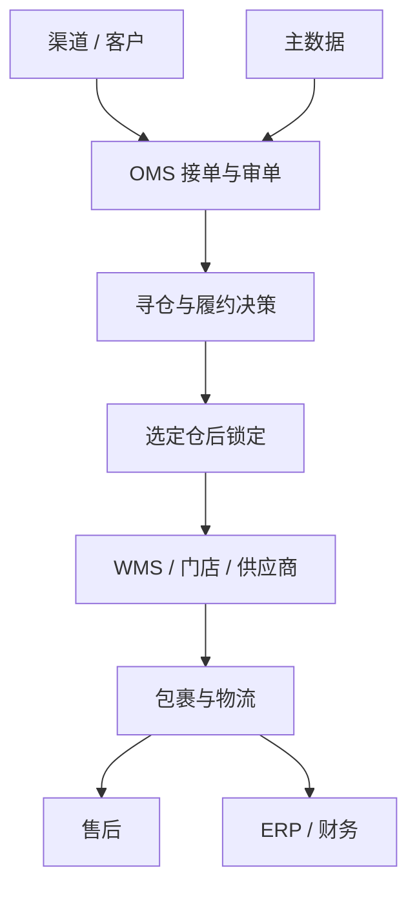

# OMS 总览

> 本专栏用市面 OMS 的通用逻辑，整理一套可供学习的业务模型。图和默认规则用来建立完整链路；与具体项目不一致的地方，以各页「待确认问题」跟踪，不把通用规则写成已经上线的事实。

OMS 连接销售渠道、订单、库存、仓库、物流、售后和财务。它首先记录客户买了什么，再协调库存与履约，并接收仓库和物流的执行结果。

## OMS 在业务链路中的位置


```mermaid
flowchart TB
  C["渠道 / 客户"] --> O["OMS 接单与审单"]
  M["主数据"] --> O
  O --> F["寻仓与履约决策"]
  F --> I["选定仓后锁定"]
  I --> W["WMS / 门店 / 供应商"]
  W --> T["包裹与物流"]
  T --> A["售后"]
  T --> E["ERP / 财务"]
```

订单中心回答**客户买了什么、订单处于什么状态**；履约中心回答**从哪里发、如何拆合、交给谁执行**；WMS 回答**仓内如何拣货、复核和出库**。库存中心管理可售、锁定、扣减和释放，主数据为这些动作提供稳定编码和关系。

## 典型订单全链路

```text
渠道下单 → 幂等接单 → 商品/客户/组织校验 → 识别业务模式
  → 审单（自动通过或挂起）→ 按模式校验支付或信用
  → 寻仓 → 选定节点后锁定库存 → 拆合、选择承运商
  → 下发 WMS / 门店 / 供应商
  → 出库形成包裹与运单 → 回传渠道 → 签收或完成
  → 对账、结算，以及可能的售后
```

这是学习用的主链路。单仓且仓库在下单时已经确定，可以在放行时直接锁定，不必先寻仓。校验失败、审单挂起、支付超时、缺货、拦截、出库失败、取消和退货进入异常或逆向流程。库存按实际进度释放、扣减或回补。

对象、状态和库存流水见[单据、状态与库存流水](./domain-model.md)。本专栏默认：多仓先寻仓再锁定，默认不超卖，订单头状态由行数量推导。

## 按模块阅读

| 主题 | 核心问题 | 页面 |
| --- | --- | --- |
| 对象和状态 | 一张单有哪些对象，状态由什么推导？ | [单据、状态与库存流水](./domain-model.md) |
| 主数据与模式 | 编码能否识别订单，这笔单按哪种模式走？ | [主数据中心](./master-data.md)、[商品中心](./product-center.md)、[客户与渠道](./customer-channel.md)、[业务模式](./business-mode.md) |
| 交易 | 怎么审、怎么付钱、金额如何落到行？ | [订单中心](./order-center.md)、[审单与挂起](./order-audit.md)、[支付与放行](./payment.md)、[金额与分摊](./pricing.md) |
| 库存 | 可售、渠道配额、缺货和预售如何区分？ | [库存中心](./inventory-center.md)、[渠道库存](./channel-inventory.md)、[缺货与预售](./shortage-presale.md) |
| 正向履约 | 从哪里发、如何改、包裹和运单是什么？ | [履约中心](./fulfillment.md)、[改单与拦截](./order-change.md)、[包裹、运单与回传](./package-logistics.md) |
| 逆向与财务 | 取消、退换、报修、退款和结算如何闭环？ | [售后中心](./after-sales.md)、[报修入口](./repair-intake.md)、[财务与结算](./finance-settlement.md) |
| 跨系统保障 | 数据如何传递，失败后如何恢复？ | [系统集成与数据流转](./integration.md)、[异常中心](./exception.md) |

## 阅读与核实原则

每页将业务目的、流程、核心数据、系统边界和待确认问题分开描述。项目里尚无完整的生产接口、表结构和业务规则资料，因此“建议”“示意”不能当作当前系统已实现的行为。把待确认问题与实际流程、接口和代码逐项核对，可按[OMS 学习与输出路线](./learning-roadmap.md)记录证据。
