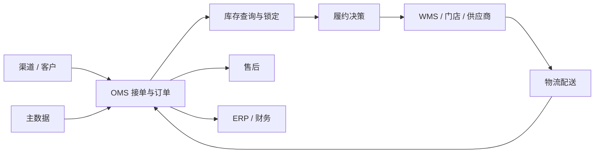

# OMS 总览

> 本专栏是基于项目现有业务资料整理的 OMS 初版知识库。图示表达通用业务关系，支付、信用、寻仓、拆单等规则是否适用，要以实际业务模式和系统契约为准。

OMS 连接销售渠道、订单、库存、仓库、物流、售后和财务。它首先记录客户买了什么，再协调库存与履约，并接收仓库和物流的执行结果。

## OMS 在业务链路中的位置


```mermaid
flowchart LR
  C[渠道 / 客户] --> O[OMS 接单与订单]
  M[主数据] --> O
  O --> I[库存查询与锁定]
  I --> F[履约决策]
  F --> W[WMS / 门店 / 供应商]
  W --> T[物流配送]
  T --> O
  O --> A[售后]
  O --> E[ERP / 财务]
```

订单中心回答**客户买了什么、订单处于什么状态**；履约中心回答**从哪里发、如何拆合、交给谁执行**；WMS 回答**仓内如何拣货、复核和出库**。库存中心管理可售、锁定、扣减和释放，主数据为这些动作提供稳定编码和关系。

## 典型订单全链路

```text
渠道下单 → OMS 接单与幂等识别 → 商品/客户/组织校验
  → 按业务模式校验支付或信用 → 查询并锁定库存
  → 寻仓、拆合及配送决策 → 下发 WMS / 门店 / 供应商
  → 出库与物流回传 → 签收或完成 → 对账、结算及可能的售后
```

这是用于理解链路的示意，并非每笔订单都经过在线支付、WMS 或同一结算顺序。校验失败、支付失败、缺货、出库失败、取消和退货分别进入异常或逆向流程；库存要按实际履约进度释放、扣减或回补。

## 按模块阅读

| 主题 | 核心问题 | 页面 |
| --- | --- | --- |
| 主数据与基础资料 | 编码和关系是否能让订单被正确识别？ | [主数据中心](./master-data.md)、[商品中心](./product-center.md)、[客户与渠道](./customer-channel.md) |
| 交易与库存 | 买了什么、订单状态是什么、货是否可用？ | [订单中心](./order-center.md)、[库存中心](./inventory-center.md) |
| 正向履约 | 从哪里发、由谁发、如何回传？ | [履约中心](./fulfillment.md) |
| 逆向与财务 | 取消、退换、退款和结算如何闭环？ | [售后中心](./after-sales.md)、[财务与结算](./finance-settlement.md) |
| 跨系统保障 | 数据如何传递，失败后如何恢复？ | [系统集成与数据流转](./integration.md)、[异常中心](./exception.md) |

## 阅读与核实原则

每页将业务目的、流程、核心数据、系统边界和待确认问题分开描述。项目里尚无完整的生产接口、表结构和业务规则资料，因此“建议”“示意”不能当作当前系统已实现的行为。把待确认问题与实际流程、接口和代码逐项核对，可按[OMS 学习与输出路线](./learning-roadmap.md)记录证据。
