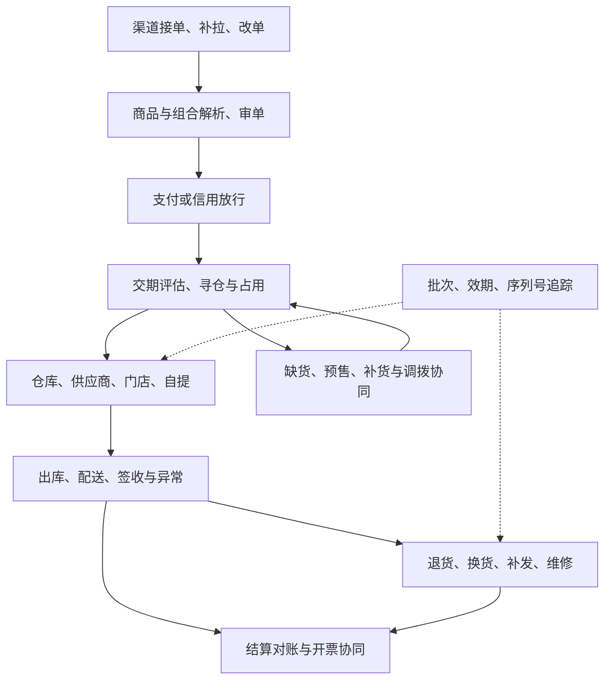

# OMS 业务覆盖与缺口清单

> 本清单用于持续检查“有哪些业务、讲到了什么深度、开发前还要确认什么”。文档覆盖不代表后端已经实现；一期范围仍以[建设路线](./construction-plan.md)为准。

## 本轮检查结论

原有内容已覆盖接单、审单、支付、库存占用、仓库履约、退货退款与基础技术设计。本轮发现的缺口主要是：入口补偿、复杂商品、货源补充、交付承诺、不同执行节点、B2B 放行、逆向衍生单、在途异常和账单核对。只把它们写成枚举或一句“按规则处理”，不足以支持开发。

以下分级是本专栏的实施建议：**P0** 是一期闭环需要的能力；**P1** 是相关业务启用前必须实现的扩展；**按行业**表示取决于经营商品和渠道。即使暂不实现 P1，也应在接单时拒绝或挂起不支持的场景。

## 按链路核对业务覆盖

| 环节 | 原有内容与缺口 | 本轮补齐入口 | 优先级与实施输入 |
| --- | --- | --- | --- |
| 渠道接入 | 有订单去重，缺补拉水位、导入修复和渠道改单裁决 | [渠道接单、补单与订单变更](./order-intake.md) | P0：渠道增量接口、版本及改取消能力 |
| 商品与促销 | 有 SKU 和赠品概念，缺父子行、套装库存和退货分摊 | [组合商品、赠品与促销落单](./bundle-gift.md) | P1：套装拆解方、赠品规则、退款协议 |
| 现货不足 | 有缺货策略，缺采购/调拨需求到入库的衔接 | [补货、采购协同与调拨](./replenishment-transfer.md) | P0 要定义缺货出口；自动协同 P1 |
| 预售 | 有在途承诺，缺批次延期、尾款及转现货裁决 | [缺货与预售](./shortage-presale.md)新增完整流程 | P1：供应批次、付款和发货承诺 |
| 交付承诺 | 有寻仓原则，缺截单日历、整单齐套和服务等级 | [交期承诺与履约规则](./delivery-promise.md) | P0：发货时限、部分发货和区域能力 |
| 仓库之外的执行 | 有代发名称，缺拒单、未知结果、门店接单和自提核销 | [供应商直发、门店发货与自提](./node-fulfillment.md) | P1：节点能力、库存权威和结果查询 |
| 经销与大客户 | 有信用概念，缺合同交期、分批额度与逾期处理 | [经销、企业订单与信用协同](./b2b-credit.md) | P1：财务额度接口、合同和结算主体 |
| 换货与补发 | 有售后类型，缺退旧发新关联、差价和二次售后 | [换货、补发与售后衍生单](./exchange-reship.md) | P1：先退后换或先换后退、批准量 |
| 物流异常 | 有运单轨迹，缺未揽收、丢损、拒收和赔付处理 | [物流异常、拒收与赔付协同](./logistics-exception.md) | P0：异常责任、补拉能力和客户处理策略 |
| 结算与开票 | 有财务边界，缺账单粒度、跨期差异和开票申请生命周期 | [结算对账与开票协同](./settlement-reconciliation.md) | P0 对账；自动结算/开票 P1 |
| 商品质量追踪 | 有商品属性，缺批次、效期、序列号及召回单据 | [批次、效期、序列号与召回](./traceability.md) | 按行业：商品特性、仓库追踪能力 |
| 运行管理 | 已有异常工作台、权限、任务与恢复设计 | [运营工作台与权限](./operations.md)、[一致性与恢复设计](./consistency-recovery.md) | P0：责任人、时限和受控修复命令 |

## 各模块怎样连起来

每个扩展都要同时解释销售数量、执行数量、库存变化与资金变化。例如换货新发的 1 件不能再次累加到原销售行的初次已发数量；调拨在途也不能当成目的仓现货。

## 哪些能力不直接放进 OMS

| 相邻能力 | OMS 保留的职责 | 由相邻系统负责的工作 |
| --- | --- | --- |
| 采购与供应计划 | 汇总缺货需求、关联供应批次、读取交期 | 采购寻源、合同审批、供应商付款及生产排程 |
| WMS 仓内执行 | 下达履约/退货需求、读取实际出入库与质检 | 货位、波次、拣货、复核、包装和库内盘点 |
| TMS 运输执行 | 承运服务选择、运单/轨迹关联、异常协同 | 车辆路线、装载、运输调度和运费核算 |
| 促销与客户权益 | 保存已确认优惠及活动快照、处理退货关联 | 营销活动经营、积分账户和优惠券发放 |
| 财务与税务 | 提交业务依据、开票诉求、查询处理结果 | 会计处理、税务判断、资金清算和正式开票 |
| 专业维修 | 报修受理、进度追踪、转退换关联 | 维修工艺、工单作业和配件维修核算 |

若未来一体化产品也承载这些能力，应另建有边界的模块，不能通过修改订单状态替代专业业务单据。

## 仍然需要项目资料才能补定的部分

当前可以补齐通用业务流程与设计检查项，但以下内容没有真实资料，不能编造成既定规则：渠道订单及回调协议、仓库库存和拦截能力、销售合同、退款/退运费政策、结算账单、商品质量要求、峰值与时限。

每一项决策保存“待确认问题、建议基线、确认人、来源、版本、生效范围、对应验收用例”。跨境多币种、订阅/虚拟交付、生产按单制造、复杂返利和积分账户未纳入本轮自建实物 OMS 基线；如果经营模式包含这些，先补专题并调整数据模型，再开启入口。

## 参考与使用边界

本轮用官方产品说明交叉检查业务遗漏：微软的 [DOM 概览](https://learn.microsoft.com/en-us/dynamics365/commerce/dom)说明履约来源选择要考虑约束与目标；Shopify 的[库存调拨说明](https://help.shopify.com/en/manual/products/inventory/inventory-transfers)区分地点间转移与发运，[组合商品说明](https://help.shopify.com/en/manual/products/bundles/eligibility-and-considerations)展示组合件数量约束及子件售后关系。本文具体流程、范围与数据设计是本项目的建议方案，并不复制某一产品的限制或接口。
