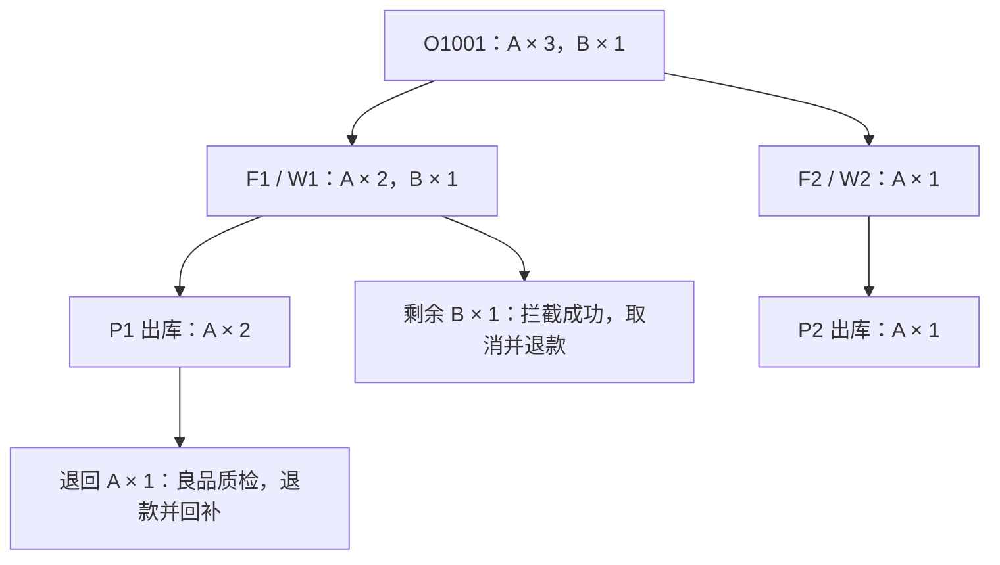

# 业务场景与单据推演

> 以下使用虚构单号和固定规则，便于将业务、表结构和验收串起来。金额为 CNY，无运费和优惠；不代表某个渠道的实际售后政策。

## 一笔订单贯穿正向与逆向

订单 `O1001` 已支付 500 元：行 `L1` 买 SKU-A 3 件，每件 100 元；行 `L2` 买 SKU-B 1 件，200 元。仓 W1 有 A 2 件、B 1 件，仓 W2 有 A 1 件。全部为可售良品，没有其他占用和安全库存。

### 接单、审单和分配

1. 渠道发送订单，按渠道、店铺、外部订单号去重；订单行保留稳定外部行号。
2. 审单通过并确认可信支付流水 500 元，满足放行条件。
3. 寻仓产生 F1、F2 两张任务；L1 分到两个仓，L2 分到 W1。每份分配分别记录占用。
4. 占用成功后把下发任务写入本地待发送表；事务提交后由任务执行器联系 WMS。

寻仓读到的库存只是候选依据，最终是否成功以原子占用结果为准。第二个仓占用失败时，根据本次策略整单回滚或保留已分配部分并挂起剩余，不能在失败后默认为全部成功。

### 部分出库与取消

W1 先回传 P1，只发 A 2 件，B 尚未出库。此时 L1 已发 2、未发 1；L2 已发 0、未发 1。订单展示“部分发货”，不能把 F1 直接标成全部出库。

客户取消 B：OMS 先登记取消请求，再请求 WMS 拦截 F1 的 B 1 件。收到最终拦截成功后，结清这 1 件占用、增加取消数量，并建立 200 元退款申请。退款方返回成功才增加已退款金额。

W2 随后回传 P2 发出 A 1 件。订单订购 4 件，已发 3 件，已取消 1 件，未发 0 件。履约已结清，可以展示“已发货（部分取消）”，不能要求已发数量等于原始订购数量。

### 退货与退款

客户从 P1 退 A 1 件，售后单关联 L1、P1 及其发货明细。审核通过后形成退货通知；WMS 收货并判定良品才回补 W1 可售库存。退款 100 元单独请求并等待成功结果。

退回的 1 件不会从“历史已发 3 件”中减去。已发是出库事实，已退是逆向事实；把已发改成 2 会破坏出库和原包裹对账。

## 数量与金额核对

| 阶段 | 已发 | 已取消 | 未发 | 已退良品 | 剩余占用 | 已成功退款 |
| --- | ---: | ---: | ---: | ---: | ---: | ---: |
| 分配完成 | 0 | 0 | 4 | 0 | 4 | 0 元 |
| P1 出库 | 2 | 0 | 2 | 0 | 2 | 0 元 |
| B 拦截成功且退款成功 | 2 | 1 | 1 | 0 | 1 | 200 元 |
| P2 出库 | 3 | 1 | 0 | 0 | 0 | 200 元 |
| A 退货及退款成功 | 3 | 1 | 0 | 1 | 0 | 300 元 |

最终按 SKU 核对：A 原有 3、出库 3、良品退入 1，现有 1；B 原有 1、没有出库，释放占用后仍有 1。原支付 500、成功退款 300、未退余额 200。这个余额是业务核对数，不自动等于会计收入。

## 同一条链路的异常分支

| 场景 | 处理过程 | 验收证据 |
| --- | --- | --- |
| 同一订单推送两次 | 返回原订单；内容冲突进入冲突记录 | 只有一张订单，原快照不被覆盖 |
| 商品映射缺失 | 原始请求保留并挂起，修复后重放 | 重放仍使用原外部单号和行号 |
| 支付比订单先到 | 持久化为待关联事件，订单到达后补关联 | 支付只入账一次，补关联有记录 |
| W2 最后一件货被抢占 | 原子占用失败，重新选仓或挂起剩余 | 不产生负可售，不生成无库存下发 |
| F1 下发响应超时 | 按原请求号查 WMS；未知则继续占用 | 不新建第二张任务，不立即释放 |
| 取消 B 时已经出库 | 接纳真实出库，取消拒绝或部分成功 | 已出库量转售后，不能释放成可售 |
| P1 出库事件重复 | 命中事件和出库明细唯一键，返回已有结果 | 实物、占用、已发数量只变化一次 |
| A 退回判为残次 | 登记残次库存，不增加良品可售 | 良品、残次流水和售后质检一致 |
| 退款请求超时 | 保留退款额度占用，按原退款号查询 | 不能另发一笔退款绕过未知结果 |

## 从场景输出研发任务

每个场景都应形成四份关联材料：业务规则、状态与数量变化、接口输入输出、验收数据。以上示例对应[数据模型与约束](./data-design.md)的订单行、分配、占用、包裹明细、售后行和退款行。

新增经销、预售或供应商直发时，复制场景记录模板，明确替换了哪项放行、库存或结算规则。不能只增加一个业务类型枚举就认为支持了新模式。
