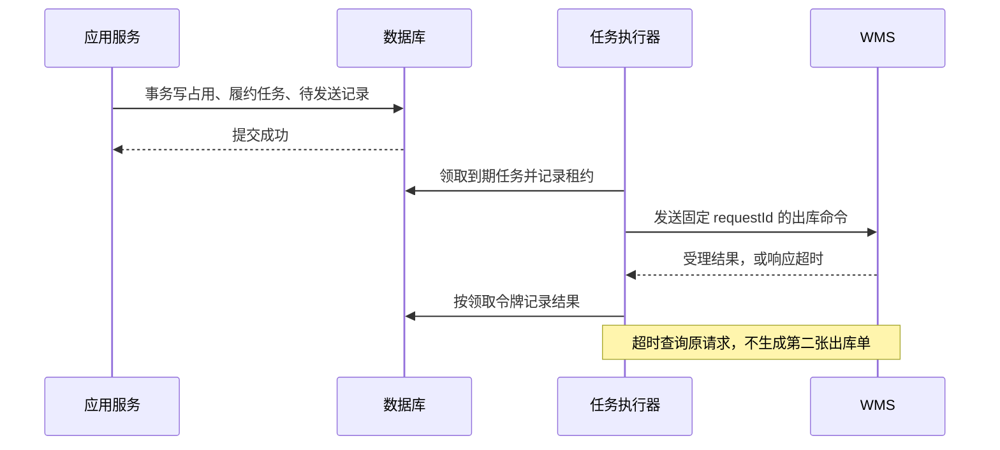

# 一致性与恢复设计

> 目标是业务事实只生效一次、失败可恢复、差异可解释。网络消息可能重复、迟到或丢失，本设计通过本地事务、业务幂等、结果查询和对账收敛，不假设跨系统天然只执行一次。

## 本地提交和外部调用分开

以库存占用后下发 WMS 为例，同一事务写入占用、履约任务和 `outbox_task`。任务执行器提交领取结果后再调用外部系统。即使应用在事务提交后立刻崩溃，待发送记录仍在库中，重启后可以继续发送。

WMS 已执行、OMS 尚未记成功时崩溃，重试仍可能再次联系 WMS，因此外部请求号幂等或按号查询是必要能力。仅增加一张待发送表不能独自防止对端双发。

## 两类可靠记录

| 记录 | 关键字段 | 保证什么 |
| --- | --- | --- |
| `outbox_task` | `request_id, action, target, payload_revision, payload_hash, status, attempt, next_run_at, lease_until, claim_token, last_error` | 本地意图不会在提交后丢失；请求内容可追溯 |
| `inbound_event` | `source, event_id, business_key, schema_version, payload_hash, received_at, status, attempt, next_run_at, last_error` | 回调已持久化，可重试业务处理 |

发送任务状态可用 `PENDING → RUNNING → SUCCEEDED`，失败分为 `RETRY_WAIT`、`UNKNOWN`、`MANUAL_REQUIRED`、`FAILED_FINAL`。`SUCCEEDED` 表示该发送动作完成，不代表 WMS 已出库；出库仍由对应业务事件确认。

入站事件按来源 + eventId 去重，实际业务再按出库、支付、收货明细去重。业务事务中同时更新数量和事件处理状态；崩溃回滚后可重做，提交后重复读取可返回已有结果。映射缺失等错误保留原事件，修复后重放，不修改原始报文。

## 任务租约与崩溃恢复

1. 执行器用数据库条件更新或短事务锁领取到期任务，设置 `lease_until` 和本次唯一 `claim_token`。
2. 网络调用在领取事务提交后执行；长调用可续租，但续租也必须匹配 token。
3. 写成功或失败时带上本次 token，旧执行器不能覆盖新执行器接管后的结果。
4. 定时扫描待执行、到期重试及租约过期的 RUNNING 任务；领取后按原业务号查外部结果或重试。
5. 已达人工处理条件的任务保留业务事实、外部查询结果和处理入口。

租约解决任务“谁来推进”，库存占用解决“货承诺给谁”，两者不能共用过期策略。租约到期也挡不住旧执行器正在进行的网络请求，最终仍依赖外部幂等和查询。

定时调度只是唤醒扫描。进程停机错过某个时间点后，恢复时扫描所有 `next_run_at <= 当前时间` 的记录，不能只执行当前时间槽而永远漏掉历史任务。批量扫描要使用稳定排序与游标，避免处理一页后状态变化导致 offset 跳过下一页。

## 重试与结果未知分开处理

| 失败类型 | 动作 | 是否可释放库存/退款额度 |
| --- | --- | --- |
| 参数错误、映射缺失 | 修复资料或挂人工，不无限自动重试 | 根据业务阶段判断，不由 HTTP 码直接决定 |
| 临时限流、服务不可用 | 有上限的指数退避加随机扰动 | 仍保留未决业务占用 |
| 超时、断连、响应无法解析 | 按原请求号查询；未知则等待核实 | 不释放 |
| 权威最终拒绝且不再执行 | 记录证据，按业务流程撤销或重新分配 | 可以结清对应未执行部分 |
| 部分成功 | 按明细确认成功、失败和未知量 | 只处理已裁决的部分 |

重试次数、最大等待时间和升级责任人按对端能力配置。达到重试上限表示自动处理停止，不能把未知结果改成“业务失败”后自动释放。

## 取消和出库的并发裁决

取消请求在本地锁住相关订单行、分配和占用，先阻止产生新的下发命令。尚未被执行器领取的发送任务可以在同一事务中取消并释放；已被领取、已发送或结果未知的任务，均按可能已到达 WMS 处理，需查询或拦截。

| 已知事实 | 允许的处理 |
| --- | --- |
| 本地尚未下发，且已原子阻止发送 | 取消剩余分配并释放对应占用 |
| WMS 确认最终拦截成功并给出未发量 | 只取消确认的未发量，已发部分保留 |
| WMS 确认已经出库 | 按实际出库结清占用，取消失败部分转售后 |
| 接单、拦截或出库结果未知 | 保留占用，进入查询或人工处理 |
| 最终拦截成功后又收到矛盾出库事实 | 隔离异常并查外部明细，记录库存缺口；不能重复释放或丢弃出库事实 |

“事件发生时间更晚”不能自动裁决跨系统冲突，因为时钟和投递顺序不可靠。优先使用业务状态约束、对端版本、最终裁决及行数量证据。

占用到期仅表示应开始核查：从未发送且能阻止发送时可释放；已经外发的占用不能按 TTL 直接清空。改仓也要等旧仓未发部分可撤销，再新建分配和请求。

## 库存增量与快照如何共存

一期建议先用“期初快照 + 有唯一明细键的增量事实”维护实物镜像，出库、退货、盘点都走同一库存入口。全量快照主要用于对账，不能随时覆盖余额后再重复应用已包含的出库事件。

若对端提供库存版本水位，则在同一仓/SKU 等库存维度内：选定快照水位，建立该水位的余额，再按顺序回放水位之后的增量，并记录已处理水位。快照前的事件不得再次应用。若对端只能提供带时间的数量，没有一致水位，就使用停写窗口或人工对账初始化，不宣称可以无损自动合并。

库存下调后即使出现“实物少于现有占用”，也要保留真实差异、冻结新的分配并处理缺货，不能为了满足非负展示而篡改实物。已下发订单优先核实执行方结果。

## 对账与人工修复

按订单行核对已发/取消量，按库存维度核对实物和占用，按原支付核对成功退款与处理中额度，按业务号核对对端单据。分页保存水位和进度，完成一次全量扫描后再推进水位；回调迟到时允许窗口重叠，靠幂等去重。

差异记录保留本地值、外部值、取数时间、水位、责任人和修复动作。人工只能执行“补拉事件、重放原事件、确认最终失败、冲正错误流水”等受控命令；修复后再次对账，匹配后关闭差异。具体页面见[运营工作台与权限](./operations.md)。
