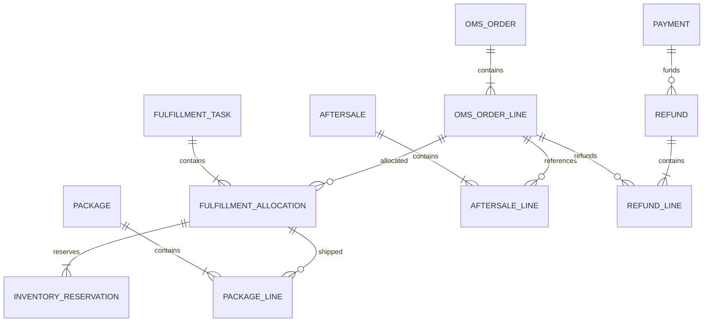

# 数据模型与约束

> 本页为一期逻辑表设计，不是可直接执行的生产建表脚本。采用事务型关系数据库，单经营主体、CNY、整数件数；确定数据库版本、外部协议和容量后，再补完整 DDL、索引及迁移脚本。

## 从关系建立表结构



`fulfillment_allocation` 表示某订单行分给某个任务的数量。包裹行引用分配，退款行引用订单行及取消/售后来源，所以拆到两个仓、分两次出库也能追溯。换仓应撤销旧分配并新建分配，不覆盖旧仓库。撤销分配可能为改仓，也可能为客户取消，必须保存原因；只有确认客户取消才增加订单行的已取消数量。

## 核心表和必要字段

所有业务表保留主键、创建/更新时间；可并发修改的聚合保留 `version`。外部单号使用字符串，避免丢失前导零。以下唯一键均在当前经营主体范围内生效；若以后支持多租户，所有读写、关联和唯一键都必须包含租户隔离设计。

| 表 | 必要业务字段 | 唯一性及关联约束 |
| --- | --- | --- |
| `oms_order` | `order_no, channel_id, shop_id, external_order_no, audit_status, payment_status, fulfillment_status, aftersale_status, payable_minor, currency` | `order_no` 唯一；渠道 + 店铺 + 外部订单号唯一 |
| `oms_order_line` | `order_id, external_line_no, sku_id, ordered_qty, cancelled_qty, shipped_qty, returned_qty, payable_minor, product_snapshot` | 订单 + 外部行号唯一；同 SKU 可有不同行价，不能用 SKU 去重 |
| `order_snapshot` | `order_id, revision, address_snapshot, buyer_snapshot, pricing_snapshot, source_payload_ref` | 订单 + 修订号唯一；原快照不可覆盖，执行任务绑定修订号 |
| `payment` | `order_id, provider, merchant_id, transaction_no, amount_minor, currency, status` | 支付方 + 商户 + 支付流水唯一；校验订单绑定和币种 |
| `inventory_balance` | `owner_id, warehouse_id, sku_id, quality, on_hand_qty, reserved_qty, safety_qty, source_version` | 货主 + 仓 + SKU + 质量唯一；一期无批次，扩展时需加库存维度 |
| `inventory_reservation` | `allocation_id, balance_id, reserve_request_id, reserved_total, consumed_qty, released_qty` | 占用请求 + 分配 + 库存维度唯一；未结清量由三项数量计算 |
| `inventory_ledger` | `balance_id, reservation_id, source_system, business_key, line_key, operation, delta_on_hand, delta_reserved` | 来源 + 业务明细键 + 动作唯一；只追加，纠错用关联冲正 |
| `fulfillment_task` | `task_no, warehouse_id, executor, dispatch_request_id, payload_revision, status` | 任务号、下发请求号分别唯一；重试不可改变已冻结的下发内容 |
| `fulfillment_allocation` | `task_id, order_line_id, allocated_qty, shipped_qty, revoked_qty` | 任务 + 订单行唯一；已发 + 已撤销不得超过分配，撤销明细区分改仓与交易取消 |
| `package` / `package_line` | 包裹：执行方、外部包裹号、承运商、运单号；明细：包裹、分配、出库明细号、数量 | 外部包裹号按执行方作用域唯一；出库明细按来源唯一；运单号不替代出库幂等键 |
| `cancel_request` / `cancel_line` | 请求号、申请行及数量、任务号、拦截请求号、裁决、证据引用 | 请求号唯一；每行分别记录成功、拒绝和未知数量 |
| `aftersale` / `aftersale_line` | 售后号、类型、原订单行、原包裹行、申请/批准/收货数量、质检结果 | 外部售后号按渠道店铺唯一；收货明细另外保存来源唯一键 |
| `refund` / `refund_line` | 原支付、退款号、币种、申请金额、状态；明细：订单行、取消或售后来源、金额 | 退款号唯一；来源行累计退款额度受控；支持一来源拆至多笔原支付 |

主数据至少包括组织、货主、SKU、仓库、店铺及外部编码映射。接入记录与任务另设 `inbound_event`、`outbox_task`、`operation_log`、`reconciliation_diff`，字段见[一致性与恢复设计](./consistency-recovery.md)和[运营工作台与权限](./operations.md)。

## 状态不要压进一个字段

审单、支付、履约、售后是不同维度。售后处理中仍可能已经全部发货，退款失败也不该把仓库出库状态改回待发货。订单列表上的“综合状态”是展示投影，命令是否允许执行必须读取各维度和明细数量。

例如：`audit=PASSED`、`payment=PAID`、`fulfillment=SHIPPED`、`aftersale=PROCESSING` 可以同时成立。已退款金额单独累计；部分退款不应把整笔支付事实改成“未支付”。

## 必须保持的数量关系

```text
订单行：订购 = 已取消 + 已发 + 未发
未发 = 未分配 + 已分配未出库
分配：分配量 = 已发 + 已撤销 + 剩余待执行
占用：剩余占用 = 原始占用 − 已消耗 − 已释放
退货：累计已退 <= 可退来源的历史已发
良品库存：可承诺 = 良品实物 − 良品占用 − 安全库存
```

在这个库存模型中残次单独存一条质量维度，良品实物中已经不含残次，计算时不能再减一次。可承诺小于零时停止新分配并生成差异，展示给渠道可以截为零，但不能靠截零掩盖内部缺口。

订单行的已发、已取消等汇总值必须与分配、包裹和取消明细在同一事务更新，并支持重建校验。并发分配时还要锁定订单行，保证所有有效分配的剩余待执行量之和不超过行未发量，不能只锁库存而让同一需求被分配两次。退货和退款是另外的事实，不倒扣历史已发，也不恢复已取消行的订购需求。

## 占用事务示意

以下 SQL 展示单库存维度的条件更新，参数由应用绑定，省略具体 DDL。多行分配应在同一事务中按稳定顺序锁定，失败则按本次业务策略回滚。

```sql
UPDATE inventory_balance
SET reserved_qty = reserved_qty + :qty,
    version = version + 1
WHERE id = :balance_id
  AND :qty > 0
  AND on_hand_qty - reserved_qty - safety_qty >= :qty;
```

仅影响一行才表示余额预留成功。同一事务还要写占用、流水、分配和待发送任务。占用请求的唯一键负责去重：并发重复请求若触发唯一冲突，必须回滚整个事务，再读取已有结果；不能捕获异常后把刚才增加的占用提交。

释放与出库都先锁定具体占用，校验本次量不超过剩余占用，再写对应唯一流水和余额变化。重复出库若只检查“当前实物够不够”，仍可能重复扣减，因此业务明细幂等键不可省略。

## 金额精度与可退额度

一期 CNY 使用整数分保存金额，比例计算在应用内用十进制定点计算，分摊后校验总和。币种随订单、支付和退款保存；不同币种不可直接求和。原支付成功后不覆盖金额，退款另记明细。

```text
支付可再申请退款 = 原支付成功金额 − 已成功退款 − 处理中退款
来源行可再退款 = 该取消/售后批准金额 − 已成功退款 − 处理中退款
```

申请退款时在同一事务校验并占用两层额度。查询超时、结果未知的退款继续占用额度；只有最终确认失败且不可再执行的退款才能释放。仅用“已成功退款”计算余额会让两笔并发申请同时通过。

## 索引、历史和删除

查询索引从真实工作台入口推导：店铺 + 创建时间 + 主键用于查单，状态 + 下次执行时间 + 主键用于任务领取，订单行用于聚合明细，外部请求号用于追踪。大量列表采用稳定排序和游标翻页，避免边翻页边新增造成重复或遗漏。

订单、流水、已发送任务和审计记录不提供普通物理删除操作。地址、电话和原始报文要限制访问并按保留策略归档或脱敏；历史事实的可追溯性不等于允许永久明文存储个人资料。

## 扩展业务对模型的影响

本页的关系图和条件占用示例针对一期普通实物销售。启用下列业务前先扩展来源关系及数量约束，不能在原表添加类型标记后就绕过校验：

| 业务 | 新增或扩展的对象 | 不可破坏的约束 |
| --- | --- | --- |
| [渠道补单与改单](./order-intake.md) | 来源订单、同步检查点、导入行结果、变更命令 | 推送、补拉及重放最终只映射一张来源订单 |
| [组合与赠品](./bundle-gift.md) | 组合版本、销售父行、组件需求、赠品来源 | 父子不双扣库存、不双计金额，重审不重复赠送 |
| [补货调拨](./replenishment-transfer.md) | 缺货需求、供应承诺、需求供应关联、调拨镜像 | 实物、在途、供应承诺各自记账，部分收货按实收 |
| [预售](./shortage-presale.md) | 供应批次占用、分阶段付款、转现货记录 | 只转实际可用量，转入与结清旧承诺不可重复 |
| [交期承诺](./delivery-promise.md) | 原始承诺、最新预计、节点日历、改约与决策版本 | 不覆盖原承诺消除逾期，不将未知改派结果当成功 |
| [直发与自提](./node-fulfillment.md) | 供应商承诺、节点受理、自提任务与核销明细 | 直发不扣自有库存，自提不伪造包裹、核销不双扣 |
| [企业订单](./b2b-credit.md) | 交货计划、合同快照、信用授权及转换流水 | 计划不超订单量，冻结、已转换暴露和释放可核对 |
| [换货补发](./exchange-reship.md) | 售后独立发货需求、退旧与新发关联、差价 | 新发受批准量约束，不累加原销售行初次已发 |
| [物流异常](./logistics-exception.md) | 异常案件、影响明细、处置与索赔记录 | 客户处理、实物处置、索赔回款分别推进 |
| [账单和开票](./settlement-reconciliation.md) | 账单明细及调整、匹配关系、票据申请与引用 | 来源幂等，处理中金额占额度，不覆盖旧账期事实 |
| [批次与 SN](./traceability.md) | 批次库存维度、包裹身份、退货身份及召回 | 同一实物不重复交付，冻结与实物数量分开 |

一种扩展若改变履约需求粒度，要同时调整分配、占用、出库、取消、售后和汇总投影，并迁移历史关联。上表是逻辑设计输入，完整 DDL 与迁移仍需在后端工程中实现和验证。

## 建表前检查

- 每个字段有类型、是否必填、默认值、单位、来源和修改权限。
- 每个状态迁移有前置条件；金额、数量不依赖页面校验。
- 唯一约束覆盖外部订单、支付、命令、出库与退货明细。
- 外键或应用完整性校验有明确选择，不能出现指向其他主体的明细。
- DDL、初始化数据、升级脚本和对应约束验收一起评审。
