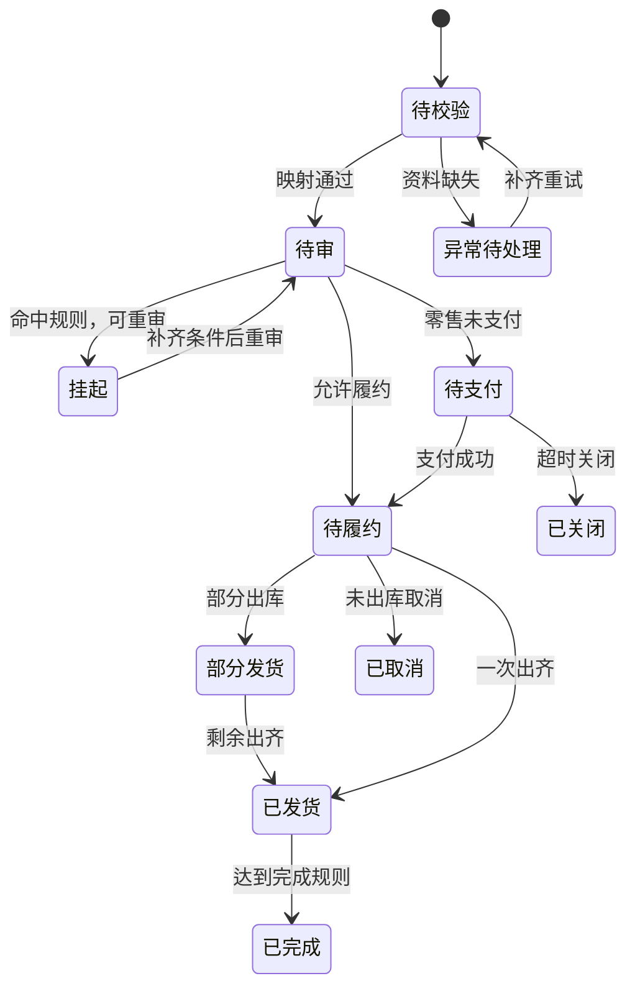

# 单据、状态与库存流水

> 本页是 OMS 的通用学习模型，用来把订单、库存和履约放在同一套对象上理解。它不是某一家生产系统的表结构。落到具体项目时，以实际单据和状态名为准。

OMS 里最容易混的是「一张订单一个状态」。通用做法是把头、行、履约任务、包裹分开，库存变化写成流水，而不是只改一个数量字段。

## 核心对象

| 对象 | 回答的问题 | 建议的唯一键 |
| --- | --- | --- |
| 原始渠道订单 | 渠道推来的是哪一笔 | 渠道 + 店铺 + 外部订单号 |
| OMS 订单 | 内部如何识别这笔交易 | 内部订单号 |
| 订单行 | 买了哪个 SKU、多少数量、多少金额 | 内部订单号 + 行号 |
| 库存占用 | 哪一行在哪个仓锁了多少 | 占用单号；业务请求号保证重复锁定返回同一次结果 |
| 履约任务 / 发货单 | 这次由谁、从哪发、发多少 | 履约任务号；下发 WMS 使用业务请求号 |
| 包裹 | 实际出库的包 | 包裹号，关联履约任务与订单行 |
| 运单 | 物流公司如何承运这个包 | 承运商 + 运单号 |
| 售后单 | 退、换、补、拒收、报修的诉求 | 售后单号；外部售后号按渠道 + 店铺区分 |
| 库存流水 | 某次数量为什么变了 | 流水号，关联业务单号与请求号 |

名称可以改，关联使用稳定主键或业务编码。订单保存客户和地址快照，订单行保存商品与价格快照。后续主数据变更不改写下单快照；合法改单另存修订并绑定执行任务。

一张 OMS 订单可以有多行，一行可以拆到多个履约任务，一个履约任务可以产生多个包裹，一个包裹通常对应一个运单。合包时，一个包裹可以包含多个订单的行，但金额、售后和结算仍回到原订单行。

## 订单头状态

订单头的履约状态由各行数量汇总得来，不能反过来用头状态代替行数量。审单、支付、履约、售后分别保存；下图是供阅读的综合流程，不是一列数据库状态枚举。实现时参考[数据模型与约束](./data-design.md)。



数量关系：

- 订购数量 = 已取消数量 + 已发数量 + 未发数量
- 未发数量 = 未分配数量 + 已分配未出库数量；未分配包含待审、待支付、待寻仓和缺货等待，不能只记缺货
- 头状态为「已发货」时，应发数量已经全部出库；仍有未发数量时，头状态最多是「部分发货」

完成规则要事先约定，常见是全部签收，或全部出库后经过固定天数。不要把「已发货」直接当成财务已确认收入。部分发货、已发货和已完成都可以发生售后，但不覆盖原履约事实。已发 3 件、剩余 1 件取消时，未发为零，履约已结清；全部 4 件取消且从未发货时才展示已取消。退款进度另外判断，示例见[业务场景与单据推演](./business-scenarios.md)。

## 行与履约任务状态

订单行和履约任务使用更细的执行状态：

```text
待分配 → 已锁定 → 已下发 → 部分出库 → 已出库
              ↘ 已取消（释放占用）
         已下发 → 拦截中 → 拦截成功并释放 / 拦截失败转人工
```

同一行可以一部分已出库、一部分仍待分配。取消、改仓、补发都按这一部分的数量处理，不整行覆盖。

状态事件保留来源版本、发生时间和接收时间。迁移规则与来源版本用于判断顺序，发生时间用于追踪，不能单凭跨系统时间戳裁决冲突。迟到的「已接单」不能把「已出库」盖回去。

## 库存流水

可售数量是算出来的结果。每一次变化落一条流水，类型至少包括：

| 流水类型 | 何时产生 | 对数量的影响 |
| --- | --- | --- |
| 锁定 | 选定仓库并承诺给订单行 | 锁定增加，可售减少 |
| 释放 | 未外发且已阻止发送的取消/到期占用，或对端最终确认未执行的部分 | 锁定减少，可售恢复；已外发结果未知时不按超时直接释放 |
| 出库扣减 | WMS 回传实际出库数量 | 实物减少，对应锁定结清 |
| 退货回补 | 退货收货且质检为可售 | 实物增加；残次品进不可售，不进可售 |
| 在途增加 / 转现货 | 采购或调拨在途、入库完成 | 预售可售或现货可售按规则变化 |
| 盘点调整 | 盘点差异被权威库存系统确认 | 按差异增减实物，并触发对账 |

重复请求用同一个业务请求号，返回已有流水，不能再记一笔。部分出库只扣实际出库数量，剩余锁定继续占用或按取消规则释放。

出库和库存同步要共用可去重的实物事实入口，避免出库回调扣一次、包含该出库的库存快照再扣一次。快照与增量水位及占用到期处理见[一致性与恢复设计](./consistency-recovery.md)。

## 本专栏使用的学习默认

后面的页面都按这三条往下写，避免同一件事有两种说法：

1. **多仓订单先寻仓，选定仓库后再锁定。** 下单时仓库已经确定、且只有一个可发仓，可以在放行时直接锁定。
2. **默认不超卖。** 可售不足就换仓、部分发货或挂起，不先下发再假设库存够。
3. **头状态由行数量推导。** 部分发货、部分取消、部分退货都保留行和包裹上的数量证据。

## 建议同时记住的业务事件

接单、审单通过、支付成功、库存锁定、履约下发、出库回传、物流签收、取消、拦截、退款、退货入库。每个事件都要能回答：谁发起、权威来源是谁、唯一键是什么、重复了怎么办、失败后如何恢复。交互细节见[系统集成与数据流转](./integration.md)和[异常中心](./exception.md)。
