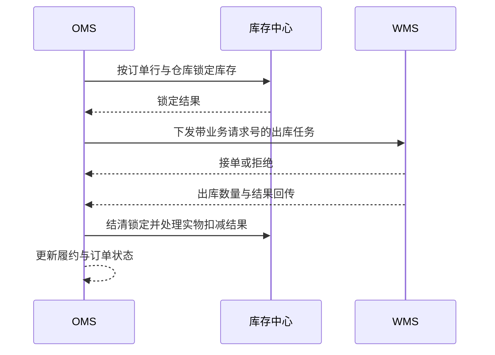

# 系统集成与数据流转

> 本页整理 OMS 与相邻系统的业务交互。以下消息字段和保障方式是设计检查项，并非已核实的生产接口。

## 交互边界

| 对端 | OMS 发送或读取 | OMS 接收 | 业务边界 |
| --- | --- | --- | --- |
| 渠道/客户系统 | 订单接收结果、状态与售后进度 | 下单、支付/取消、售后申请 | OMS 统一内部订单模型 |
| 商品/组织等资料来源 | 同步结果、失败原因 | 商品、客户、组织、仓库等主数据 | 权威来源及改写权限需确认 |
| WMS | 出库、撤销、退货入库任务 | 接单、出库、收货和异常结果 | WMS 负责仓内作业 |
| 物流/TMS | 承运需求、查询或订阅 | 运单、轨迹、签收和拒收 | 物流事件不替代仓库出库事实 |
| ERP/财务 | 订单、发货、退货和结算依据 | 信用、开票、退款与对账结果 | ERP/财务负责核算及资金结果 |

不同业务模式可能绕过 WMS，由门店或供应商直发；此时仍需定义接单、发货和物流回传的责任方。

## 一次出库交互（示意）

这是业务先后关系。实际锁定、扣减和回传协议要以库存权威系统为准，不能把图中的交互直接当成接口实现。

## 一致性与恢复

- **标识清楚**：请求携带来源系统、业务单号、事件标识或版本；每个系统保存外部与内部单号映射。
- **重复安全**：对端响应丢失后重发同一业务请求，接收方按业务标识返回既有结果；不可生成第二张出库单或重复扣库存。
- **顺序可判断**：状态事件携带发生时间或版本，迟到消息不能回退已确认状态。部分出库与取消需按数量处理。
- **失败可见**：记录发送、接收、业务处理三类结果与失败原因；超时后先查询对端是否已受理，再决定重试或补偿。
- **定期对账**：核对订单、出库、库存、物流和财务关键数量及状态，差异形成可追踪的修复任务。

重试、补偿和对账的触发点见[异常中心](./exception.md)。主数据同步还需考虑编码映射、版本和生效时间，见[主数据中心](./master-data.md)。

## 待确认问题

- 各方向实际使用同步接口、消息还是批量文件？超时与失败如何确认对端受理状态？
- 外部订单号、出库单号、运单号、事件 ID 与版本如何对应？
- 哪个系统是库存、物流签收、退款和结算结果的权威来源？
- 生产环境有哪些重试、人工补偿及跨系统对账任务？
