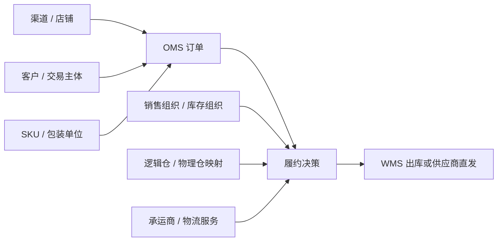

# 主数据中心

> 本页基于项目现有 OMS、商品、客户渠道、库存、履约和集成页面整理初版业务模型。字段与流程用于说明设计关注点；实际数据归属、规则和接口仍需核实，待确认项列在文末。

## 业务目的与范围

主数据回答订单处理前的基础问题：**谁在交易、卖什么、由哪个组织负责、从哪里发、由谁配送**。订单、库存和履约引用同一套有效编码，才能把渠道订单转为内部订单，并把发货任务交给正确的 WMS 仓库或供应商。

主数据记录相对稳定的业务身份、属性和关系。订单金额、实时库存、库存锁定量、应收余额属于业务数据，不能只靠修改主数据维护。商品、客户与渠道的细节分别见[商品中心](./product-center.md)和[客户与渠道](./customer-channel.md)。

| 资料域 | 主要对象 | OMS 使用场景 | 需确认的资料来源 |
| --- | --- | --- | --- |
| 组织 | 集团、法人公司、销售组织、核算组织、库存组织及其关系 | 订单归属、库存归属、结算主体 | 组织/ERP 系统 |
| 仓库与履约节点 | 逻辑仓、物理仓、门店、供应商直发节点 | 寻仓、可售范围、出库任务路由 | OMS、WMS 或供应商系统 |
| 商品 | SPU、SKU、条码、包装、计量单位、履约属性 | 商品识别、订单校验、库存匹配 | 商品/ERP 系统 |
| 客户与渠道 | 渠道、店铺、客户、经销商、供应商及映射 | 订单归属、交易模式、履约和结算 | 渠道/客户系统 |
| 物流 | 承运商、物流服务、配送范围 | 快递匹配、物流单回传 | 物流/TMS 系统 |

上表是待核实的责任划分，并不表示项目已经实现相应接口或数据库表。

## 对象关系与系统边界



- **组织**：销售组织表示订单业务归属，库存组织定义存货和库存业务边界。法人、核算组织与库存组织未必一一对应。原页面提到库存组织管理存货和库存成本，实际成本核算责任仍需财务规则确认。
- **仓库**：OMS 需要寻仓和路由所用的逻辑仓、服务范围与可履约状态；WMS 管理物理仓内的货位、拣货、复核和出库执行。逻辑仓到物理仓、门店或供应商节点的映射需要可追溯。
- **商品**：渠道商品编码必须能定位内部 SKU 及订单计量单位；历史订单保留下单时的商品快照。
- **客户**：下单人、收货人、交易客户、结算客户、经销商和供应商可能是不同主体，不能合并成一个客户字段。
- **物流**：承运商档案识别承运主体；按地区、商品和时效选择服务的规则属于履约策略。

## 组织与仓库资料

| 对象 | 建议记录的关键属性或关系 | 主要使用方 |
| --- | --- | --- |
| 组织 | 内部编码、名称、类型、上级组织、生效状态和期间 | 订单、库存、财务 |
| 逻辑仓 | 内部仓编码、所属库存组织、节点类型、服务区域、可售/可发状态 | 库存、寻仓 |
| 履约节点映射 | 逻辑仓编码、外部 WMS 仓/门店/供应商编码、来源系统、生效期间 | 发货任务、状态回传 |
| 承运商与服务 | 内部及外部编码、服务类型、适用区域、启停状态 | 快递匹配、物流回传 |

需要确认一个逻辑仓是否能对应多个物理仓、同一物理仓是否服务多个库存组织。若允许多对多映射，寻仓和回传至少要同时识别组织、仓库与来源系统，避免只凭仓名或外部仓编码定位错误。

## 从建档到订单使用

```text
来源系统建档或变更
  → 校验编码、归属关系、生效时间和必填属性
  → 建立外部编码与 OMS 内部编码映射
  → 发布有效版本并同步到使用方
  → 渠道订单按有效映射解析
  → 履约按有效组织、仓库和承运商资料决策
  → 保留引用编码及必要快照，供回溯和对账
```

例如渠道商品 A 从仓库 B 发货：接单先识别渠道、店铺和交易模式，再将渠道商品映射到内部 SKU，确认销售组织与库存组织，查询可用逻辑仓和库存，最后把选定节点映射成 WMS 可识别的仓库编码。任一映射缺失时，应进入可定位的异常处理，不能默认替换商品、组织或仓库。

## 校验、变更和同步

1. **编码唯一且有来源**：内部编码在其资料域中唯一；外部编码映射至少按来源系统和业务范围区分。名称可改，不应用名称作关联键。
2. **校验后生效**：组织、仓库、商品和物流资料满足必要关系与状态约束后，才允许新订单引用。停用前检查未完结订单、库存和履约任务。
3. **历史可解释**：保留来源、外部编码、版本或变更时间、生效时间；订单保存必要快照。改名、换码和归属调整不能让历史订单失去解释依据。
4. **同步可重试、可对账**：按来源标识和版本/更新时间处理重复消息，记录失败原因；支持补发，并定期比对来源与 OMS 的编码、状态和映射。
5. **区分资料与业务事件**：主数据同步不等于库存数量、出库结果或物流轨迹完成；各业务链路分别回传和对账。

这些是初版建议的控制点。当前仓库没有实际接口协议、表结构或任务配置，不能据此认定已经实现。

## 系统实现时需要明确的接口

| 方向 | 需要识别的信息 | 失败后的处理重点 |
| --- | --- | --- |
| 来源系统 → OMS | 对象类型、来源、外部编码、内部编码、版本/变更时间、有效状态 | 记录无法解析的编码和关系，允许补发 |
| OMS → WMS / 供应商 | 组织、履约节点及外部编码、SKU 和单位 | 下发前验证对端映射，拒绝错误路由 |
| WMS / 物流 → OMS | 来源、业务单号、仓库/承运商编码、事件时间 | 依据业务单号与来源识别回传，幂等处理 |

具体字段、同步频率和幂等键需要以双方系统契约确定。订单与库存事件的一致性处理见[系统集成与数据流转](./integration.md)。

## 待确认问题

- 各资料域由哪个系统创建、审批和维护？OMS 可以改哪些属性，哪些只能只读接收？
- 法人、销售组织、核算组织、库存组织的真实关系是什么？哪些维度参与库存成本核算？
- 逻辑仓与 WMS 仓、门店、供应商直发节点的映射基数和生效规则是什么？是否按渠道或组织隔离？
- 渠道商品、客户、店铺和承运商是否已有统一编码？换码、合并、停用如何影响在途订单？
- 主数据通过接口、消息还是批量任务同步？补发、版本冲突和日常对账由谁负责？
