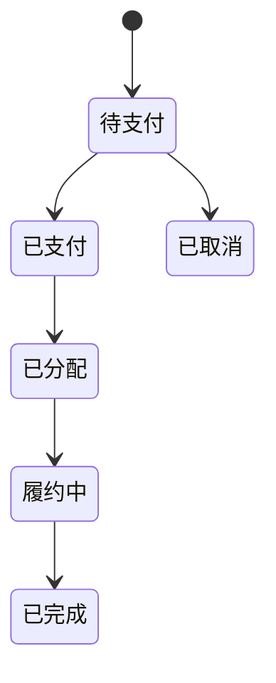

# 订单中心

## 业务理解

订单中心负责订单生命周期、拆单/合单和履约单生成。

## 生命周期（示意）

```mermaid
stateDiagram-v2
  [*] --> 待支付
  待支付 --> 已支付
  已支付 --> 已分配
  已分配 --> 履约中
  履约中 --> 已完成
  待支付 --> 已取消
```

## 设计记录

后续补充领域模型、接口、状态转换约束和幂等策略。
