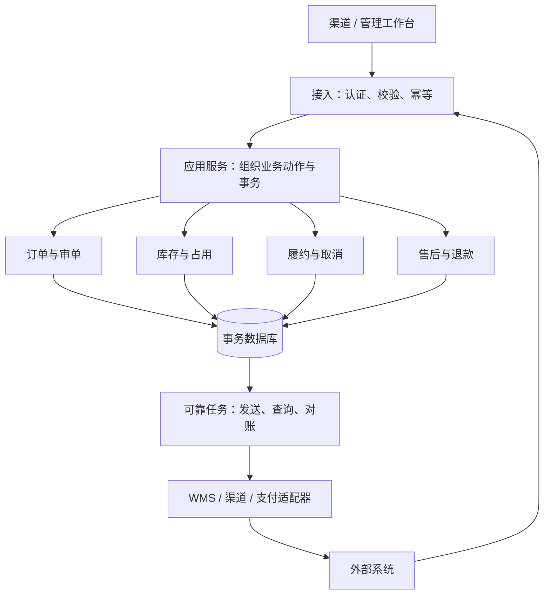

# 模块架构与事务边界

> 这是第一版自建 OMS 的建议结构。当前博客仓库没有这些后端模块；包名、接口名和任务名用于后续设计，不表示已实现。

## 从模块化单体开始

一期建议一个应用、一个事务数据库，内部按业务模块分工；外部接口通过适配器接入。订单、库存和履约的本地写入可以使用同一个事务，先把一致性和恢复路径做清楚。是否拆服务由独立扩容、团队边界和故障隔离需求决定。



## 模块职责与写入权限

| 模块 | 拥有的数据与行为 | 不应直接承担 |
| --- | --- | --- |
| masterdata | SKU、组织、货主、仓库、渠道映射 | 改写历史订单快照 |
| order | 接单、头行快照、审单、支付放行、数量汇总 | 直接调用 WMS 下发 |
| inventory | 库存余额、占用、释放、出库与入库流水 | 决定订单是否应该退款 |
| fulfillment | 寻仓、分配、下发、包裹、拦截及改仓 | 改写渠道支付成功事实 |
| aftersales | 售后申请、可退数量、质检关联、退款申请 | 未收货就增加良品库存 |
| integration | 外部编码转换、发送与接收记录、协议适配 | 绕开领域规则直接修改订单状态 |
| operations | 异常、对账差异、任务租约、审计 | 提供任意字段修改接口 |

应用服务协调多个模块；跨模块动作调用模块公开能力。即使使用同一个库，也不要让控制器或定时任务绕过业务方法直接更新其他模块表。

## 代码层次示意

```text
oms
  order / inventory / fulfillment / aftersales / masterdata
    api             请求、响应、内部模块接口
    application     业务用例、事务编排
    domain          状态迁移、数量约束、规则
    infrastructure  持久化与外部实现
  integration       渠道、WMS、支付适配器和消息契约
  operations        可靠任务、对账、异常和审计
```

Java 后端可将“接单”“分配”“处理出库”“申请取消”“确认退款”各自作为一个应用用例。技术框架和版本在创建后端仓库时确定，本页不预设当前已使用某个版本。

## 事务以业务动作划分

| 动作 | 同一事务提交的本地数据 | 提交之后的工作 |
| --- | --- | --- |
| 接单 | 幂等记录、订单头行、快照、审单任务 | 异步审单或返回接单结果 |
| 分配 | 库存条件占用、占用明细、分配、履约任务、待发送记录 | 联系 WMS |
| 出库回传 | 接收事件处理标记、包裹明细、出库流水、结清占用、数量汇总、渠道回传任务 | 回传渠道 |
| 确认取消 | 最终取消证据、取消数量、释放流水、退款申请和任务 | 请求退款方执行 |
| 确认退货 | 收货事件、质检数量、对应质量库存流水、售后进度 | 达到退款条件后发起退款 |
| 确认退款 | 退款事件、退款明细、额度结清、订单资金汇总 | 通知渠道及业务人员 |

网络请求放在数据库事务外。持有库存锁等待 WMS 或退款响应，会放大锁等待，并且本地回滚也撤销不了对端已经执行的动作。先把业务意图和待发送记录一起提交，再可靠发送，详见[一致性与恢复设计](./consistency-recovery.md)。

## 关键调用链

```text
ShipmentCallbackController
  → 校验来源并持久化接收事件
  → ShipmentApplicationService.handle(eventId)
  → 加锁读取任务、分配和占用
  → 校验出库明细未处理且数量未超分配
  → InventoryService.confirmShipment(...)
  → 更新包裹、分配及订单行汇总
  → 插入渠道回传任务，标记事件处理完成
  → 提交
```

接收事件和业务处理可以分成两个事务。对端拿到“已接收”只表示原始事件已落库，业务处理失败必须在异常工作台可见并能重试；不能接到报文后先确认成功、再把报文仅放进内存队列。

## 规则配置如何生效

审单、寻仓排序、拆单和承运匹配各自使用独立规则集，保留版本、有效期和命中原因。每次履约决策保存使用的规则版本及候选结果摘要。修改规则影响后续决策；重试同一外部命令沿用已生成的任务内容，不能偷偷重算仓库或数量。

先用明确优先级的配置和代码实现有限规则；只有规则维护频率和复杂度确实需要时再引入规则引擎。第一版需要的是能解释“为何选这个仓”，而不是堆满可配置表达式。

## 何时再拆服务

库存拆成独立服务后，订单与库存不再能共用本地事务，需要预留确认、取消补偿和对账协议。拆之前先确认库存接口能按请求号查询、重复调用安全、过期如何裁决，并让同样的并发与崩溃用例重新通过。拆分不会自动解决一致性问题。
